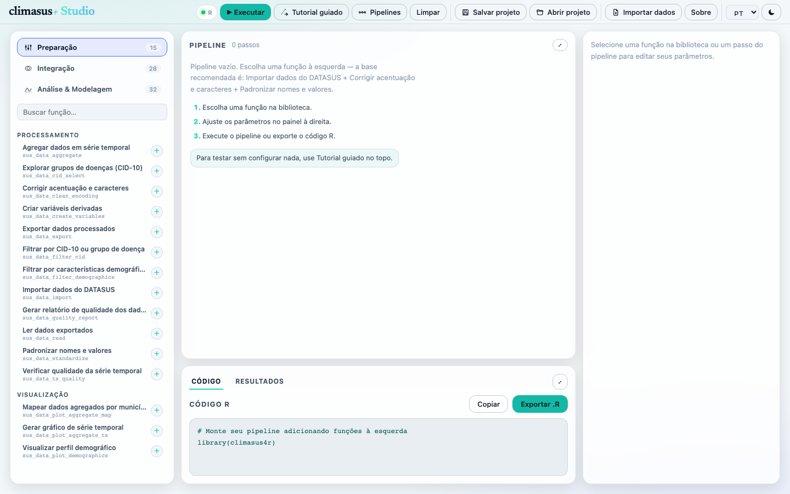
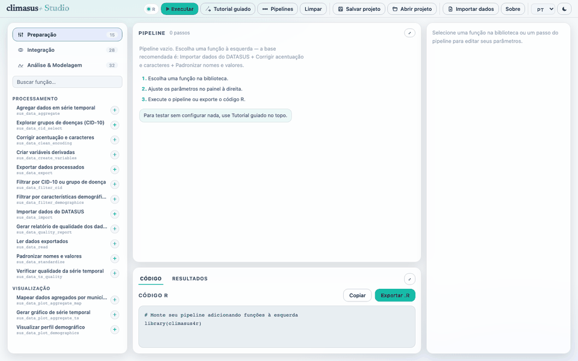

# climasus+ Studio

Estúdio visual para montar e executar análises de saúde, clima e ambiente do DATASUS — encadeando as funções do pacote [climasus4r](https://github.com/ByMaxAnjos/climasus4r) como um pipeline, **sem precisar saber R**. O motor de análise já vem embutido no aplicativo.

## Visão geral

O climasus+ Studio organiza a análise em uma área de trabalho visual: a Biblioteca fica à esquerda, o Pipeline no centro, o Código/Resultados abaixo e o Inspetor de parâmetros à direita.



### Demonstração rápida

O GIF abaixo mostra o fluxo completo do **Tutorial guiado**: o Studio monta o pipeline, executa os passos offline com dados de exemplo, abre o painel de Resultados e exibe o gráfico temporal e o mapa em tela cheia.



Esse tutorial usa uma base leve incluída no aplicativo, então serve para testar a interface sem configurar downloads ou credenciais.

## Baixar (beta)

| Sistema | Download |
|---|---|
| **macOS** (Apple Silicon) | [climasus+.Studio_1.0.0_aarch64.dmg](https://github.com/ByMaxAnjos/climasus-plus/releases/download/v1.0.0/climasus%2B.Studio_1.0.0_aarch64.dmg) |
| **Windows** (x64) | [climasus+.Studio_1.0.0_x64-setup.exe](https://github.com/ByMaxAnjos/climasus-plus/releases/download/v1.0.0/climasus%2B.Studio_1.0.0_x64-setup.exe) |
| **Linux** (x64, deb) | [climasus+.Studio_1.0.0_amd64.deb](https://github.com/ByMaxAnjos/climasus-plus/releases/download/v1.0.0/climasus%2B.Studio_1.0.0_amd64.deb) |
| **Linux** (x64, AppImage) | [climasus+.Studio_1.0.0_amd64.AppImage](https://github.com/ByMaxAnjos/climasus-plus/releases/download/v1.0.0/climasus%2B.Studio_1.0.0_amd64.AppImage) |

Todas as versões em [Releases](https://github.com/ByMaxAnjos/climasus-plus/releases).

### Primeira abertura

Esta é uma **beta ainda não assinada**, então o sistema pode avisar na primeira execução:

- **macOS**: botão direito no app → **Abrir** → confirmar em **Abrir**.
- **Windows**: na tela do SmartScreen, **Mais informações** → **Executar assim mesmo**.
- **Linux**: no AppImage, dar permissão de execução (`chmod +x`) antes de rodar.

## Pessoas

O climasus+ Studio é desenvolvido por pesquisadores, desenvolvedores e comunicadores científicos envolvidos no ecossistema climaSUS:

| Pessoa | Papel | Instituição |
|---|---|---|
| Dr. Max Anjos | Coordenação · Mantenedor | Departamento de Geociêcnias, UFJF · Fiocruz-RO (CCSRO) · INCT-CONEXAO |
| Sergio Lins de Carvalho | Desenvolvedor associado | UERJ |
| Marlon Resende Faria | Desenvolvedor sênior R/Python | Universidade de São Paulo (USP) |
| Thauã Menezes | Desenvolvedor associado R/Python · Comunicação científica | UNESP · Universidade Federal de Rondônia (UNIR) |
| Andrey Araújo | Desenvolvedor associado R/Python | Fundação Oswaldo Cruz Rondônia |
| Nathalia A. Franqlin | Desenvolvedora associada · Comunicação científica | UNESP |

## Financiamento e apoio

O climasus+ Studio é parte do ecossistema climaSUS e do Centro de Clima de Saúde de Rondônia, com desenvolvimento articulado à Fiocruz Rondônia e ao INCT-CONEXAO.

- **Financiamento**: INCT-CONEXAO.
- **Apoio institucional e rede**: Centro de Clima de Saúde de Rondônia, Fiocruz Rondônia, UFJF e CNPq.
- **Ecossistema técnico-científico**: o Studio usa o pacote [climasus4r](https://github.com/ByMaxAnjos/climasus4r) como base analítica e se conecta ao ecossistema climaSUS para análises reprodutíveis em clima, ambiente e saúde.

## Como citar

Se usar o climasus+ Studio em pesquisa, ensino, relatórios técnicos ou materiais institucionais, cite o software. Os metadados completos estão em [`CITATION.cff`](CITATION.cff).

> Anjos, M. (2026). *climasus+ Studio* (v1.0.0) [Software]. GitHub. https://github.com/ByMaxAnjos/climasus-plus

BibTeX:

```bibtex
@software{anjos_2026_climasus_studio,
  author = {Anjos, Max},
  title = {climasus+ Studio},
  version = {1.0.0},
  date = {2026-08-13},
  url = {https://github.com/ByMaxAnjos/climasus-plus},
  license = {MIT}
}
```
