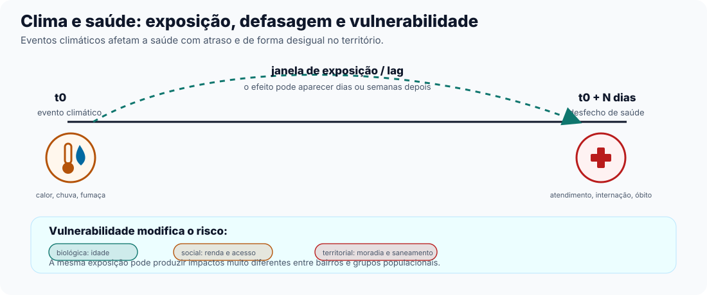

## Ideia principal

É fevereiro, semana de calor extremo em uma cidade do Sudeste. Os termômetros marcam
quase 40°C por cinco dias seguidos. Ninguém morre de calor "na hora" — mas, dias depois,
o pronto-socorro da cidade começa a receber mais idosos com pressão alta descompensada,
mais crises cardíacas, mais internações que, à primeira vista, não parecem ter relação
nenhuma com o boletim meteorológico da semana anterior.

Essa cena se repete, com outra cara, em qualquer lugar do Brasil. Uma chuva forte no
Nordeste enche os quintais de água parada — e, semanas depois, os postos de saúde veem
crescer o número de casos de dengue. Uma temporada de queimadas na Amazônia ou no
Centro-Oeste cobre o céu de fumaça — e as unidades pediátricas de pronto atendimento
enchem de crianças com crise de asma e bronquite.

Em nenhum desses três casos o problema aparece como "problema climático" no boletim de
saúde. Ele aparece como fila de espera, leito ocupado, criança com dificuldade para
respirar. Este é o argumento do capítulo: **eventos climáticos se transformam em
problemas de saúde pública, muitas vezes com atraso e sob outros nomes**. Quando clima e
saúde ficam em boletins separados, a resposta tende a chegar tarde para situações que
poderiam ser antecipadas.

Este guia apresenta uma forma de analisar clima e saúde em conjunto, com método
documentado e repetível. Antes da ferramenta, porém, é preciso entender a lógica dessa
relação.

## Tempo, clima e saúde: três relógios diferentes

Duas palavras que usamos como sinônimos no dia a dia — "tempo" e "clima" — significam
coisas bem diferentes para quem estuda saúde pública, e a diferença importa.

**Tempo** (no sentido meteorológico) é o que está acontecendo agora ou nos próximos
dias: uma onda de calor de cinco dias, uma chuva forte de uma tarde, uma frente fria que
chega no fim de semana. É um evento pontual, com começo e fim identificáveis no
calendário.

**Clima**, por outro lado, é o padrão de longo prazo: como tem sido o comportamento da
temperatura, da chuva e da umidade numa região ao longo de décadas, e como esse padrão
está mudando. Uma cidade pode ter um clima historicamente ameno e, ainda assim, viver uma
semana de calor atípico — o evento pontual (tempo) acontece dentro de um pano de fundo
que está mudando (clima).

Essa distinção importa para a saúde porque cada "relógio" pede uma resposta diferente da
gestão pública:

- Uma **onda de calor** de cinco dias pede resposta de curto prazo: alerta à população,
  reforço de plantão hospitalar, pontos de hidratação e abrigo climatizado.
- Uma tendência de **aquecimento** ao longo dos anos pede planejamento de longo prazo:
  redesenho de redes de saúde, investimento em infraestrutura urbana que reduza ilhas de
  calor, revisão de protocolos clínicos para lidar com uma frequência maior desses
  eventos.

Confundir os dois relógios leva a decisões equivocadas: tratar uma mudança estrutural
como se fosse um evento passageiro (e não investir em adaptação), ou tratar um evento
passageiro como se fosse a nova normalidade (e gastar recurso de emergência em algo que
era pontual). Gestão pública eficaz distingue qual relógio está em jogo antes de decidir
o que fazer.

## Por que o efeito demora a aparecer

Um dos erros mais comuns ao olhar dados de clima e saúde lado a lado é esperar que o
efeito apareça no mesmo dia do evento climático. Raramente é assim.

Existe, entre a exposição climática (o calor, a chuva, a fumaça) e o desfecho de saúde
(a internação, o atendimento de emergência, o óbito), um intervalo de tempo — chamado de
**defasagem** (em inglês, *lag*). O calor de hoje pode virar internação cardiovascular
só depois de alguns dias de estresse fisiológico acumulado. A chuva de hoje pode virar
caso de dengue só depois de semanas — tempo suficiente para a água empoçar, o mosquito
se reproduzir, picar alguém, e essa pessoa desenvolver sintomas.

A duração dessa defasagem varia com o tipo de exposição. Calor extremo tende a ter uma
defasagem curta (dias); chuva e vetores como o mosquito da dengue têm uma defasagem mais
longa (semanas); já a exposição contínua à fumaça de queimadas pode ter efeito tanto
agudo (crise respiratória na semana) quanto acumulado (agravamento de doença crônica ao
longo dos meses).

::: {.callout-important}
Se um gestor olha o boletim de saúde do dia seguinte a uma onda de calor e não vê nada
fora do normal, a conclusão errada é "não teve efeito". A conclusão mais adequada é
"ainda não deu tempo de aparecer" — e esse intervalo costuma ser ignorado quando clima
e saúde são tratados como dois assuntos separados.
:::

## Quem sente primeiro e quem sente mais forte

O mesmo evento climático não afeta todo mundo do mesmo jeito. Dois bairros de uma mesma
cidade podem receber a mesma onda de calor e ter números de atendimento de
emergência muito diferentes — e a diferença raramente está só na temperatura que cada
bairro registrou.

A **vulnerabilidade** a um evento climático tem, pelo menos, três camadas que se somam:

- **Biológica**: idosos regulam temperatura corporal com menos eficiência e têm mais
  doenças crônicas de base; crianças pequenas ainda têm sistema respiratório e
  imunológico em desenvolvimento — por isso aparecem como os dois grupos etários mais
  citados em qualquer análise de risco climático.
- **Social**: quem trabalha ao ar livre, tem menos acesso a água potável ou informação de
  saúde, ou não pode se ausentar do trabalho para procurar atendimento preventivo, chega
  mais exposto e mais tarde ao sistema de saúde.
- **Territorial**: moradia precária sem ventilação adequada vira forno numa onda de
  calor; bairros sem rede de drenagem acumulam água de chuva por mais tempo, criando
  mais criadouros de mosquito; proximidade de áreas de queimada ou de vias de tráfego
  intenso aumenta a exposição contínua à fumaça e à poluição do ar.

Por isso, dizer que um grupo é "mais vulnerável" não é apenas uma constatação biológica —
é, sobretudo, uma constatação social e territorial. E é também, por definição, uma
questão de política pública: infraestrutura, moradia e acesso à saúde são decisões de
gestão, não fatalidade climática.

::: {.callout-tip}
A mesma onda de calor pode atingir toda a cidade, mas o risco não se distribui de forma
igual. Em geral, ele acompanha desigualdades já conhecidas pelo gestor: moradia,
saneamento, renda, trabalho e acesso a cuidado.
:::

### Recorte: calor, chuva, ar

**Calor (e frio) extremos.** Ondas de calor prolongadas estão associadas a aumento de
óbitos e internações cardiovasculares, especialmente em idosos — um padrão observado de
forma recorrente no Sudeste e no Sul do Brasil em anos de verão mais intenso. O oposto
também acontece: ondas de frio, mais raras mas relevantes em regiões de altitude e no Sul
do país, aumentam hospitalizações por causas respiratórias e cardiovasculares,
particularmente entre populações com moradia sem isolamento térmico adequado.

**Chuva, enchente e vetores.** No Nordeste brasileiro, períodos de chuva mais intensa —
sobretudo após estiagens que deixam a população menos precavida com armazenamento de
água — costumam ser seguidos, semanas depois, por aumento de casos de dengue. O mosquito
transmissor se reproduz em água parada, e o intervalo entre a chuva e o pico de casos
notificados corresponde à janela de exposição discutida acima: chuva não vira caso
de dengue no dia seguinte, vira semanas depois.

**Qualidade do ar e queimadas.** Na Amazônia e no Centro-Oeste, a temporada de queimadas
lança fumaça e material particulado (partículas finas em suspensão no ar, pequenas o
suficiente para penetrar nas vias respiratórias) na atmosfera, que se espalha por
centenas de quilômetros. Crianças pequenas são um dos grupos mais afetados: unidades de pronto
atendimento pediátrico costumam registrar aumento de crises respiratórias (asma,
bronquite) durante e imediatamente após picos de fumaça — um efeito que, ao contrário da
dengue, tende a aparecer rápido, em poucos dias.

::: {.callout-important}
Um alerta antes de seguir adiante. Todos os exemplos deste capítulo — mais atendimento
depois do calor, mais dengue depois da chuva, mais crise respiratória depois da fumaça —
comparam números agregados por município e por período (quantos casos, quantas pessoas,
quantos milímetros de chuva), não o histórico de cada paciente em particular. Essa
agregação faz parte desse tipo de análise — mas tratar o
padrão agregado como se fosse uma regra válida para cada pessoa do grupo é um
**erro de interpretação ecológica**: um padrão que
aparece no nível da população ou do território não garante que ele se repita, do mesmo
jeito, em cada pessoa daquele grupo. Os resultados falam do padrão coletivo — o
suficiente para orientar alerta, prevenção e investimento público — e não substituem o
diagnóstico e o cuidado de um caso individual.
:::

## De observação a ação

Até aqui, cada exemplo deste capítulo foi contado como uma história separada — uma onda
de calor, uma chuva, uma fumaça de queimada — cada uma olhada isoladamente por quem
cuida do clima ou por quem cuida da saúde. Mas o padrão que atravessa os três recortes é
sempre o mesmo: um evento climático, uma defasagem, um grupo mais vulnerável que sente o
efeito primeiro e mais forte.

Descrever esse padrão, uma vez, para um evento específico, é possível com um boletim
climático numa mão e um boletim epidemiológico na outra. O problema é fazer isso de
forma **repetível** — para o próximo evento, no próximo bairro, com o próximo agravo de
saúde — sem recomeçar a análise do zero a cada vez, e sem depender de juntar
manualmente planilhas que vêm de sistemas diferentes (o **DATASUS**, a rede de sistemas
de informação em saúde do Sistema Único de Saúde que reúne registros de internações,
atendimentos e óbitos no Brasil, e as bases de dados climáticos e territoriais que
normalmente vivem em outro lugar, com outro formato, mantidas por outra equipe).

É nesse ponto que a observação precisa virar rotina de trabalho. Para passar de
"percebemos que isso aconteceu" para "sabemos quando isso costuma acontecer, para quem e
com antecedência suficiente para preparar uma resposta", a equipe precisa analisar esses
dados em conjunto, com método documentado e repetível. É isso que o restante deste guia
ensina.

::: {.callout-note collapse="true"}
## Verifique se ficou

**1. Por que um caso de dengue pode aparecer semanas depois de uma chuva forte, e não no
dia seguinte?**

Porque existe uma defasagem entre o evento climático e o desfecho de saúde, e essa
defasagem tem duração diferente para cada tipo de exposição. No caso da dengue, a água
da chuva precisa acumular, o mosquito precisa se reproduzir nela, picar alguém, e essa
pessoa precisa desenvolver sintomas — um processo que leva semanas, não horas. Esperar o
efeito no dia seguinte à chuva leva à conclusão errada de que "não teve efeito".

**2. Dois bairros recebem a mesma onda de calor. Por que um pode ter muito mais
atendimentos de emergência que o outro?**

Porque a vulnerabilidade a um evento climático não é só biológica (quem é mais velho ou
mais jovem) — ela também é social e territorial: acesso a água, qualidade da moradia
(ventilação, isolamento térmico), infraestrutura de drenagem e acesso a atendimento de
saúde variam de bairro para bairro, e essa desigualdade amplia ou reduz o impacto do
mesmo evento climático.

**3. Qual a diferença entre "uma onda de calor de 5 dias" e "o clima está esquentando"?**

A onda de calor é um evento de **tempo** — pontual, com começo e fim, que pede resposta
de curto prazo (alerta, plantão reforçado). "O clima está esquentando" descreve uma
mudança de padrão de longo prazo, que pede planejamento estrutural (adaptação urbana,
redesenho de rede de saúde). Confundir os dois relógios leva a decisões de gestão
equivocadas — tratar o passageiro como estrutural, ou o estrutural como passageiro.

**4. Um município com mais chuva registrou mais casos de dengue no mesmo período. Isso
significa que qualquer pessoa exposta a uma poça de água vai necessariamente
desenvolver dengue?**

Não. O que existe é um padrão agregado — mais chuva no território, mais casos na
população daquele município e período — e não uma garantia sobre cada indivíduo.
Tratar um padrão coletivo como se fosse uma regra individual é um **erro de interpretação
ecológica**. O padrão populacional serve para
decidir política pública (onde investir em drenagem, onde alertar a rede de saúde), mas
não substitui a avaliação clínica de um caso específico.
:::
