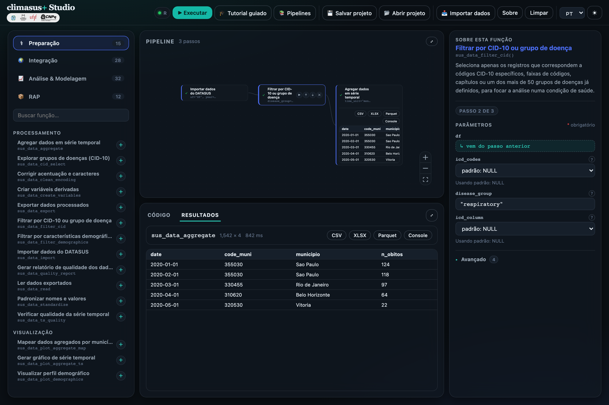
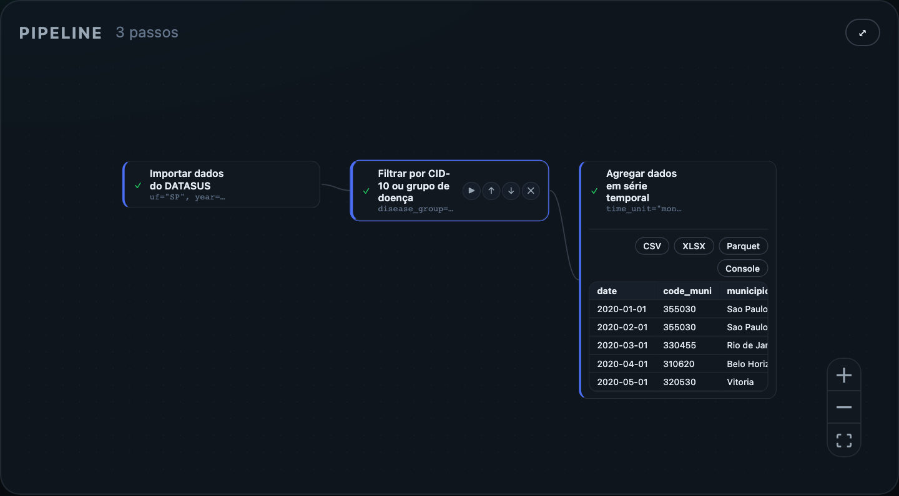
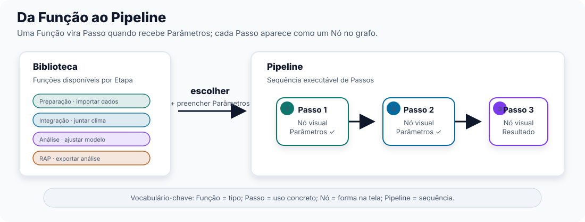
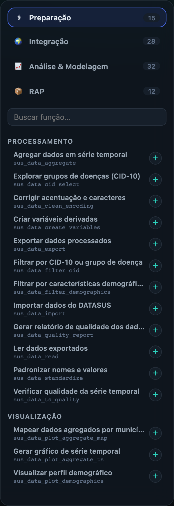
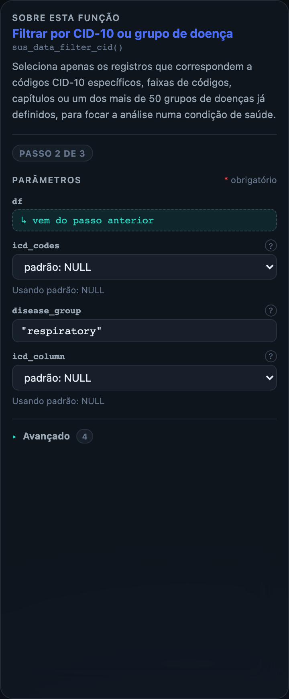
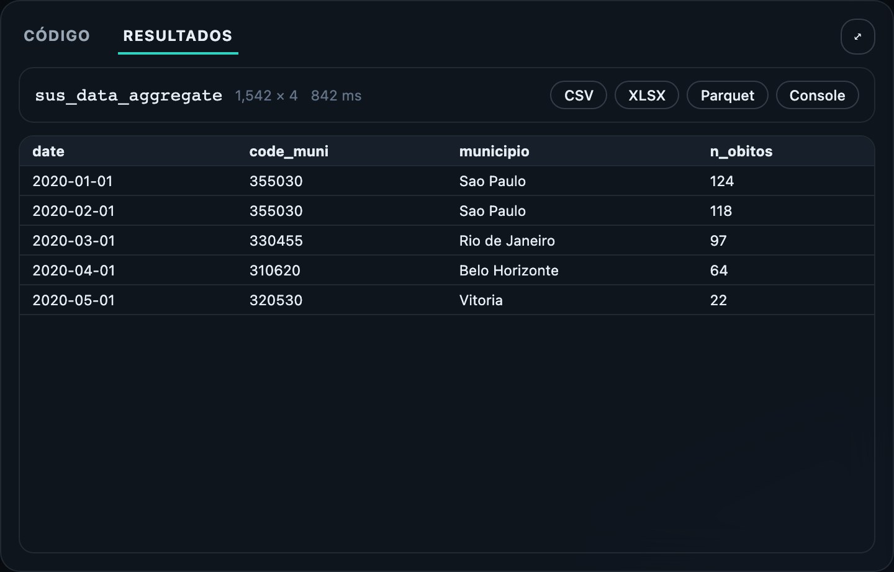

## O problema que o Studio resolve

O Capítulo 0 terminou com uma constatação prática: para agir sobre clima e saúde, não basta descrever calor, chuva ou fumaça de um lado e atendimentos de saúde do outro. É preciso analisar as duas séries em conjunto, com método documentado e possibilidade de repetição. É nessa passagem — da observação separada para a análise integrada — que muitas equipes encontram dificuldade.

Hoje, analisar essas séries em conjunto quase sempre depende de alguém que saiba programar. Um gestor de saúde tem uma pergunta — "os atendimentos respiratórios sobem depois de queimadas na nossa região?" — e precisa esperar um analista ou pesquisador montar uma análise. Se a pergunta muda — outro município, outro recorte de idade, outro período — parte do trabalho precisa ser refeita. Quando o método fica concentrado em uma pessoa, a equipe também perde capacidade de continuidade.

O climasus+ Studio foi criado para reduzir essa dependência. O objetivo principal é permitir que uma equipe consiga **montar e executar análises de clima e saúde sem precisar começar pelo código**. Isso importa de formas diferentes para quem vai ler este guia:

- Para o **gestor público**, significa autonomia — poder investigar uma pergunta própria sem abrir um chamado para "o time de dados" e esperar semanas.
- Para o **acadêmico**, significa reprodutibilidade e rastreabilidade — outra pessoa pode abrir o mesmo Pipeline depois e ver quais Passos, com quais Parâmetros, geraram aquele número.
- Para a **comunidade em geral**, significa poder entender — e até questionar — o que se diz sobre o próprio território, porque o caminho até o Resultado fica documentado.

Para cumprir esse objetivo, o Studio organiza o trabalho em quatro conceitos: Função, Passo, Nó e Pipeline. Eles aparecem na interface e serão usados em todo o guia.

{#fig-studio-visao-geral fig-alt="Captura da interface do climasus+ Studio mostrando Biblioteca, Pipeline, Inspetor e painel de Código/Resultados."}

## O modelo mental: Função → Passo → Nó → Pipeline

Quatro palavras sustentam a estrutura do Studio. Elas aparecem sempre na mesma ordem; entender essa sequência facilita a leitura da interface.

Uma Função é uma operação disponível no catálogo. Ela descreve o que pode ser feito, mas ainda não está aplicada a nenhum dado específico.

**Função**
: É uma operação definida do catálogo — por exemplo, "importar dados de saúde do DATASUS" ou "filtrar por grupo de doença". Existe apenas uma definição de cada Função, disponível na Biblioteca. É o *tipo* da operação, não o seu uso concreto.

Quando uma Função entra no Pipeline, ela passa a ter escolhas próprias: período, estado, grupo de doença, escala temporal e outros Parâmetros. Nesse momento, a Função vira um Passo.

**Passo**
: É a Função em uso, com seus Parâmetros preenchidos para o seu caso. Quando você pega uma Função da Biblioteca e decide, por exemplo, qual estado e qual período de dados importar, ela se torna um Passo — uma *instância* concreta daquela Função dentro do seu trabalho.

Cada Passo precisa aparecer em algum lugar na tela para que você possa vê-lo, movê-lo e ligá-lo a outros. No Studio, essa aparência tem nome.

**Nó**
: É a representação visual de um Passo na tela, dentro do grafo onde você monta sua análise. Cada Passo aparece como um Nó. Quando este guia fala de "olhar para o Nó", está falando do desenho na tela; quando fala de "o Passo", está falando do trabalho que aquele desenho representa.

{#fig-studio-no-pipeline fig-alt="Captura do painel Pipeline com três nós conectados. O nó central está selecionado e o último nó mostra uma prévia de tabela como resultado."}

Uma análise raramente termina em um único Passo. O resultado depende da sequência: importar, limpar, filtrar, agregar, integrar e modelar.

**Pipeline**
: É a sequência ordenada de Passos que você monta e executa. Alguns Passos preparam o terreno para os seguintes (não dá para filtrar dados antes de importá-los), e é essa cadeia, do início ao fim, que o Studio chama de Pipeline.

Em resumo: você escolhe uma **Função** na Biblioteca, preenche seus Parâmetros e cria um **Passo**; esse Passo aparece na tela como um **Nó**; a sequência de Nós ligados forma o **Pipeline**.

::: {.callout-important}
Função e Passo não são a mesma coisa. Função é a definição disponível na Biblioteca. Passo é o uso dessa Função dentro de um Pipeline, com Parâmetros preenchidos. A mesma Função pode gerar vários Passos diferentes.
:::

## A Biblioteca e as Etapas

O catálogo do Studio tem **87 Funções**. Para facilitar a escolha, elas são agrupadas em quatro **Etapas**, que correspondem às fases do trabalho analítico:

- **Preparação** (15 Funções) — organiza os dados de saúde brutos: importar, corrigir, filtrar, agregar.
- **Integração** (28 Funções) — cruza esses dados de saúde já preparados com clima, ambiente e território.
- **Análise & Modelagem** (32 Funções) — transforma tudo isso em evidência estatística: existe um efeito real, ou é ruído?
- **RAP — Reprodutibilidade, Automação, Publicação** (12 Funções) — leva um Pipeline validado para fora do Studio, para compartilhar ou repetir automaticamente.

Essa divisão segue a ordem de trabalho. Primeiro os dados de saúde precisam ser preparados; depois podem ser integrados a clima, ambiente e território; só então faz sentido aplicar modelos estatísticos. Cada Etapa tem uma cor na Biblioteca, o que ajuda a reconhecer a função de cada Nó em um Pipeline montado.

{#fig-studio-biblioteca-etapas fig-alt="Captura da Biblioteca do climasus+ Studio mostrando abas de Etapas, campo de busca e lista de Funções da Etapa Preparação."}

Os Capítulos 2 e 3 apresentam as Funções de Preparação e de Integração. Por enquanto, guarde a regra geral: a Biblioteca organiza as Funções por Etapa, e essa organização orienta a ordem do Pipeline.

Quando uma Função entra no Pipeline, o lugar principal de ajuste passa a ser o Inspetor. Ele mostra a descrição da Função selecionada, separa Parâmetros obrigatórios e avançados, e indica quais entradas vêm automaticamente do Passo anterior. Essa separação reduz a chance de editar o que não precisa ser editado.

{#fig-studio-inspetor-parametros fig-alt="Captura do Inspetor do climasus+ Studio mostrando a Função Filtrar por CID-10 ou grupo de doença, seus Parâmetros e uma seção de opções avançadas."}

## Resultado e Artefato: o que sai de um Passo

Quando você executa um Passo, algo aparece na tela — pode ser uma tabela, um gráfico, um mapa ou um texto. Essa aparição visível tem nome próprio no Studio.

**Resultado**
: É o que aparece no Nó e no painel de resultados depois que um Passo é executado. Todo Resultado tem um tipo — tabela, gráfico, mapa ou texto — e é ele que você primeiro consulta para saber "o que esse Passo produziu".

Um Resultado visto na tela ainda precisa de um arquivo para ser usado fora do Studio. Para levar um gráfico para uma apresentação ou uma tabela para uma planilha, você usa o Artefato correspondente.

**Artefato**
: É o arquivo gerado a partir de um Resultado — por exemplo, uma imagem PNG, um desenho vetorial SVG, uma página HTML interativa ou uma tabela em CSV/XLSX para baixar. Um único Resultado do tipo gráfico, por exemplo, pode gerar mais de um Artefato ao mesmo tempo (a imagem estática e a versão interativa).

A diferença é direta: Resultado é o que você interpreta dentro do Studio; Artefato é o arquivo que você leva para fora dele.

{#fig-studio-resultado fig-alt="Captura do painel Resultados do climasus+ Studio mostrando uma tabela agregada, dimensões do resultado, tempo de execução e botões CSV, XLSX, Parquet e Console."}

## Modelo, Tutorial e Centro de Pipelines: três jeitos de começar

Ninguém precisa montar um Pipeline sempre do zero. O Studio oferece dois caminhos bem diferentes para começar mais rápido, e é importante não confundi-los.

**Modelo**
: Um Pipeline já montado, carregado como ponto de partida editável. Ele vem com Passos e Parâmetros preenchidos para um uso comum — por exemplo, o Modelo "Etapas 2-4: limpar, filtrar e agregar" entrega uma sequência de Preparação que você pode ajustar para outro estado, período ou grupo de doença.

**Tutorial**
: Uma experiência guiada, com explicações na tela durante a montagem de um Pipeline. O Tutorial orienta cada escolha; o Modelo entrega um Pipeline inicial para edição livre.

Se você já sabe o que quer analisar e quer economizar tempo de montagem, carregue um Modelo. Se está aprendendo a lógica do Studio, siga um Tutorial.

Os dois ficam no **Centro de Pipelines**, o painel que lista Modelos e atalhos para Tutoriais. Um Modelo da Etapa Preparação, por exemplo, pode baixar dados do DATASUS para um estado e um período e deixar o Pipeline pronto para as próximas Funções de limpeza. Quando chegar a hora de montar uma análise, o ponto inicial pode estar ali.

## O Motor por baixo (e por que você não precisa saber)

Toda essa montagem visual — arrastar Funções, preencher Parâmetros, ver Resultados — precisa ser efetivamente executada por alguma coisa. No Studio, esse componente chama-se **Motor**.

::: {.callout-note}
"O público-alvo são profissionais de saúde/pesquisa que não sabem — nem precisam saber — programar. [...] Decidimos tratar [o executor] como detalhe interno: a UI chama o executor de 'Motor', e mensagens de erro/estado nunca citam a linguagem de programação por trás dele."

— adaptado de ADR 0001, a decisão de arquitetura que mantém o executor do Studio invisível para quem usa a ferramenta.
:::

Essa é uma decisão deliberada, não uma limitação do Studio. Se em algum momento alguém perguntar "isso roda alguma linguagem de programação por baixo?", a resposta alinhada ao Studio não é explicar qual — é reforçar que você não precisa saber disso para montar e executar um Pipeline. Você monta Passos, liga Nós, aperta **Executar**, e o Motor cuida do resto.

::: {.callout-tip}
Ao explicar o Studio para outra pessoa, evite detalhar o que roda "por dentro" do Motor. O valor dessa decisão está justamente em manter essa camada invisível — quem usa o Studio trabalha só com Função, Passo, Nó e Pipeline, nunca com a linguagem de programação que os executa.
:::

::: {.callout-note collapse="true"}
## Verifique se ficou

**1. Uma colega pergunta "isso está rodando alguma linguagem de programação nos bastidores?". Qual é a resposta mais alinhada ao Studio?**

A resposta alinhada ao Studio é: "O Motor cuida da execução; você monta o Pipeline." A pessoa que usa a ferramenta não precisa saber qual mecanismo executa os Passos. Nomear a linguagem ou o mecanismo interno desloca a conversa para uma camada que o Studio mantém fora da experiência principal.

**2. O que vira um Nó no grafo?**

Um **Passo** — não uma Função ainda disponível apenas na Biblioteca, e não um Artefato gerado por um Resultado. Uma Função só ganha um Nó visual depois que entra no Pipeline com Parâmetros preenchidos.

**3. Qual a relação entre Função e Passo?**

Função é o tipo — a definição disponível na Biblioteca. Passo é a instância — o uso concreto daquela Função, com Parâmetros preenchidos para o seu caso.

**4. Qual a diferença entre carregar um Modelo e seguir um Tutorial?**

Um Modelo dá um ponto de partida editável: um Pipeline já montado que você pode ajustar. Um Tutorial orienta a montagem e explica cada escolha. Modelo serve para adaptar uma análise conhecida; Tutorial serve para aprender o processo.
:::
