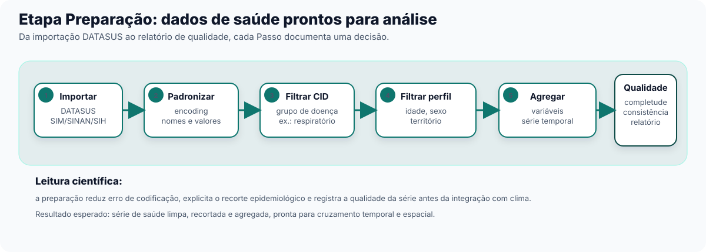
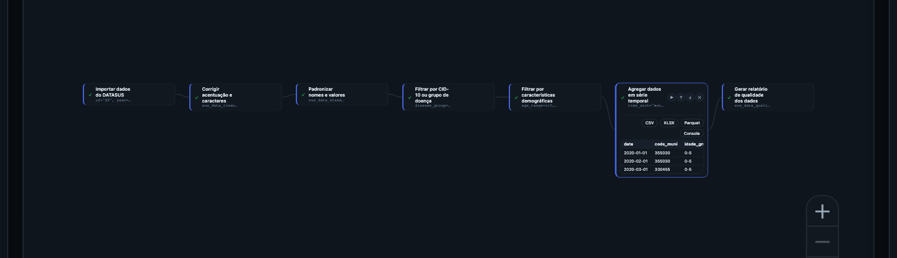

A partir deste capítulo o guia assume que você quer *fazer*, não só entender. Se seu
interesse é só acompanhar o panorama sem montar nada, pode ler a introdução de cada
seção e pular direto para o resumo "Verifique se ficou" no final — a lógica geral
continua acessível sem executar um único Passo. Mas se você é gestor técnico ou
acadêmico com um Pipeline para montar, este capítulo mostra como começar a sequência de
trabalho.

## Por que a Preparação vem primeiro

Dados de saúde brutos do DATASUS quase nunca chegam prontos para análise. Um arquivo
recém-importado do SIM, do SINAN ou do SIH costuma trazer nomes de município com
acentuação corrompida, colunas com nomes técnicos que mudam de ano para ano, e milhões
de registros de causas e faixas etárias que não têm nada a ver com a pergunta que você
quer responder. Antes de cruzar esses dados com clima ou território — o assunto do
Capítulo 3 — é preciso deixá-los limpos, padronizados e recortados para o que importa.

É esse o papel da Etapa **Preparação**: é sempre a primeira grande Etapa de qualquer
Pipeline no climasus+ Studio. Sem dados de saúde limpos e padronizados, nenhuma Etapa
seguinte funciona direito — um **Cruzar dados de saúde e clima** (`sus_climate_aggregate`) (Capítulo 3) que recebe uma série
de saúde com encoding quebrado ou datas fora de padrão não consegue cruzar
saúde com clima corretamente.

::: {.callout-tip}
## Por que isso importa para quem gerencia, não só para quem programa
Um gestor público não precisa montar o Pipeline pessoalmente, mas precisa saber *que
essa etapa existe* — porque é aqui que decisões como "que grupo de doença estamos
olhando" e "que recorte de idade" ficam explícitas e documentadas, em vez de escondidas
numa planilha que só uma pessoa sabe explicar.
:::

## As 15 Funções da Preparação, em 4 grupos

A Etapa Preparação reúne 15 Funções na Biblioteca. Elas se agrupam em quatro famílias
lógicas, cada uma respondendo a uma pergunta diferente:

**(a) Importar e ler** — como os dados entram no Pipeline.

- **Importar dados do DATASUS** (`sus_data_import`) — baixa e lê dados direto dos sistemas do DATASUS (SIM, SINAN, SIH,
  SIA, CNES, SINASC), com cache local para não repetir downloads.
- **Ler dados exportados** (`sus_data_read`) — lê de volta arquivos já processados e exportados anteriormente
  (produzidos por **Exportar dados processados** (`sus_data_export`)), com suporte a leitura em lote e paralela.

**(b) Limpar e padronizar** — corrigir o que vem torto antes de qualquer recorte.

- **Corrigir acentuação e caracteres** (`sus_data_clean_encoding`) — varre colunas de texto e corrige problemas de codificação
  de caracteres (por exemplo, "São Paulo" que chega como "Sao Paulo" ou com símbolos
  incorretos).
- **Padronizar nomes e valores** (`sus_data_standardize`) — padroniza nomes de coluna e valores categóricos, para garantir
  consistência entre diferentes anos e versões dos sistemas de origem.
- **Verificar qualidade da série temporal** (`sus_data_ts_quality`) — avalia a qualidade de séries diárias de eventos de saúde por
  município e sinaliza completude e problemas estruturais.

**(c) Filtrar** — recortar só o que interessa para a pergunta em mãos.

- **Filtrar por CID-10 ou grupo de doença** (`sus_data_filter_cid`) — filtra por código da CID-10 ou por grupos de doença
  predefinidos (respiratório, cardiovascular, dengue etc.), com suporte multilíngue.
- **Filtrar por características demográficas** (`sus_data_filter_demographics`) — filtra por características demográficas: sexo, raça,
  faixa etária, escolaridade, região, município.
- **Explorar grupos de doenças (CID-10)** (`sus_data_cid_select`) — abre uma interface interativa para explorar grupos de doença e
  fatores climáticos associados, de apoio ao uso de **Filtrar por CID-10 ou grupo de doença** (`sus_data_filter_cid`).
  Para ver a lista completa de grupos disponíveis, adicione este Passo ao Pipeline e execute-o antes
  de configurar `disease_group` em **Filtrar por CID-10 ou grupo de doença** — o Resultado abre a tela
  interativa com todos os grupos e códigos CID-10 correspondentes.

**(d) Transformar, agregar, exportar e visualizar** — preparar a forma final dos dados.

- **Criar variáveis derivadas** (`sus_data_create_variables`) — cria variáveis derivadas comuns em análise
  epidemiológica (faixas etárias, variáveis de calendário) a partir dos dados de saúde.
- **Agregar dados em série temporal** (`sus_data_aggregate`) — agrega dados individuais em contagens de série temporal, por
  unidade de tempo e variáveis de agrupamento — essencial para modelagem posterior. A
  partir deste Passo, a análise deixa de descrever o paciente individual e passa a
  descrever o comportamento de uma população — quantos casos por município, por semana
  ou por mês — que é o nível em que a Etapa Integração (Capítulo 3) e a modelagem
  seguinte trabalham.
- **Exportar dados processados** (`sus_data_export`) — exporta os dados processados com documentação de metadados, para
  reprodutibilidade.
- Visualizações prontas a partir dos dados já agregados:
  **Gerar gráfico de série temporal** (`sus_data_plot_aggregate_ts`), **Mapear dados
  agregados por município** (`sus_data_plot_aggregate_map`) e **Visualizar perfil
  demográfico** (`sus_data_plot_demographics`).
- **Gerar relatório de qualidade dos dados** (`sus_data_quality_report`) — lê o histórico de Passos aplicados e produz um relatório
  seccionado de qualidade dos dados.

::: {.callout-note}
## Por que "filtrar por CID" e "filtrar por demografia" são Funções separadas
São dois eixos de recorte independentes: um define **o quê** você está contando (que
doença, que causa), o outro define **quem** está sendo contado (que idade, que sexo, que
território). Separar os dois em Passos distintos permite recombinar cada eixo sem
recriar o Pipeline do zero — trocar o recorte de idade não exige refazer o filtro de
doença, e vice-versa.
:::

## Exercício guiado: da importação ao relatório de qualidade

Vamos retomar o recorte de **respiratório pediátrico** apresentado no Capítulo 0: óbitos
por causas respiratórias em crianças, um dos temas mais sensíveis a queimadas e má
qualidade do ar. O Modelo de catálogo `pipeline-preparacao-basica` já traz o esqueleto
dessa sequência — você pode carregá-lo no Centro de Pipelines para conferir, embora aqui
a gente monte a versão completa, com o recorte demográfico e o relatório de qualidade
que o Modelo básico não inclui.

{#fig-studio-preparacao-pipeline fig-alt="Captura do canvas do climasus+ Studio mostrando um Pipeline de Preparação com importação, correção de caracteres, padronização, filtro por CID, filtro demográfico, agregação e relatório de qualidade."}

::: {.callout-tip}
## Parâmetros que merecem atenção
Neste exercício, os Parâmetros que mudam a pergunta analítica são poucos: `system`, `uf`
e `year` definem a fonte, o território e o período; `disease_group` define o desfecho de
saúde; `age_range` define a população; e `time_unit` define a escala temporal da série.
Os demais Parâmetros podem ficar no padrão enquanto você estiver aprendendo o fluxo.
:::

### Passo a passo

1. **Importar** — Função **Importar dados do DATASUS** (`sus_data_import`). Parâmetro-chave: `system = "SIM-DO"` (óbitos),
   `uf` com os estados de interesse (ex. `"SP"`) e `year` com o(s) ano(s) de interesse (ex.
   `2022`) — os três são obrigatórios. O Resultado é uma tabela bruta de óbitos, ainda
   sem qualquer recorte.

2. **Padronizar / corrigir encoding** — Funções **Corrigir acentuação e caracteres** (`sus_data_clean_encoding`) e depois
   **Padronizar nomes e valores** (`sus_data_standardize`). Não há parâmetro que o leitor precise decidir aqui — é
   correção automática — mas o Resultado muda de "tabela suja" para "tabela com nomes de
   coluna e valores categóricos consistentes", condição para qualquer filtro funcionar
   corretamente.

3. **Filtrar por CID** — Função **Filtrar por CID-10 ou grupo de doença** (`sus_data_filter_cid`). Parâmetro-chave:
   `disease_group = "respiratory"` (grupo de causas respiratórias, códigos que começam
   com a letra J na CID-10). O Resultado passa de "todos os óbitos" para "só os óbitos
   respiratórios".

4. **Filtrar por demografia** — Função **Filtrar por características demográficas** (`sus_data_filter_demographics`). Parâmetro-chave:
   `age_range = c(0, 5)`, isolando o recorte pediátrico. O Resultado agora é "óbitos
   respiratórios em menores de 5 anos" — o mesmo recorte usado no arco ec-01 do
   catálogo.

5. **Criar variáveis e agregar** — Função **Criar variáveis derivadas** (`sus_data_create_variables`) (parâmetro
   `create_age_groups = TRUE`, com `age_breaks` definindo os cortes de faixa etária) e,
   em seguida, **Agregar dados em série temporal** (`sus_data_aggregate`) com `time_unit = "month"`. O Resultado deixa de ser
   uma lista de registros individuais e passa a ser uma série temporal mensal — a forma
   que a Etapa Integração (Capítulo 3) espera receber.

6. **Relatório de qualidade** — Função **Gerar relatório de qualidade dos dados** (`sus_data_quality_report`). Não recorta nem
   transforma nada; produz um Resultado de texto em seções, com base no histórico de
   Passos já aplicados no Pipeline.

Ao final, o Pipeline tem 6 Passos encadeados, cada um como um Nó no grafo, na ordem
acima — trocar a ordem entre filtro e agregação, por
exemplo, mudaria o resultado: agregar antes de filtrar contaria óbitos que você não quer
incluir.

## Como ler o relatório de qualidade

**Gerar relatório de qualidade dos dados** (`sus_data_quality_report`) não é um veredito de aprovação ou reprovação — é um
diagnóstico. Ele lê o que já foi feito nos Passos anteriores e organiza, em seções, o
que vale conferir: completude dos dados (faltam meses? faltam municípios?), consistência
da distribuição demográfica com o esperado, e sinais de problema estrutural na série
temporal.

::: {.callout-important}
## Um alerta no relatório não bloqueia o Pipeline
Se a seção de completude apontar meses com poucos registros, isso não impede você de
seguir para a Integração — é uma informação para *decidir com conhecimento de causa*.
Talvez o recorte de doença escolhido seja raro naquele território (esperado), talvez
haja um problema real de sub-registro (vale investigar antes de seguir). O relatório
não decide por você; ele só evita que você siga sem saber.
:::

Para o gestor público, essa seção costuma ser a mais operacional do capítulo: é o ponto
em que o Studio mostra, em linguagem direta, se a base de dados escolhida sustenta a
pergunta em análise — antes de qualquer número aparecer num relatório para tomada de
decisão.

Com uma série de saúde limpa, recortada, agregada e com seu relatório de qualidade em
mãos, o Pipeline está pronto para a próxima Etapa: cruzar essa série com dados
climáticos e de território. É esse o assunto do Capítulo 3.

::: {.callout-note collapse="true"}
## Verifique se ficou

**1. Por que filtrar por CID e filtrar por demografia são dois Passos separados, e não
um só?**

São dois eixos de recorte independentes: CID define *o quê* está sendo contado (a
doença), demografia define *quem* está sendo contado (idade, sexo, território). Separar
os dois permite recombinar cada recorte sem refazer o outro.

**2. O relatório de qualidade aponta um problema no recorte que você escolheu. Isso
significa que o Pipeline não pode continuar?**

Não. **Gerar relatório de qualidade dos dados** (`sus_data_quality_report`) é diagnóstico, não bloqueio — ele mostra o que vale
conferir, mas quem decide se segue, ajusta o recorte ou investiga a causa é quem está
montando o Pipeline.

**3. Qual Etapa vem depois da Preparação, e por que os dados precisam estar "prontos"
antes dela?**

Vem a Etapa Integração (Capítulo 3), que cruza a série de saúde já preparada com dados
climáticos e socioeconômicos. Se a série de saúde ainda tiver encoding quebrado, datas
fora de padrão ou registros que não deveriam estar no recorte, o cruzamento com clima
sai errado — a Integração confia que a Preparação já entregou uma série confiável.
:::
