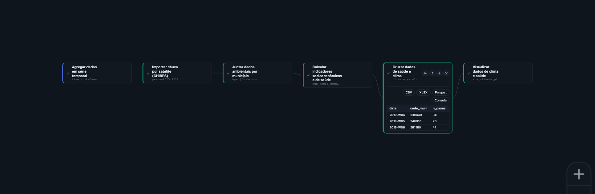

No Capítulo 0 apresentamos a ideia de que o efeito do clima na saúde geralmente aparece
com **defasagem** — o calor de hoje pode virar internação em poucos dias, a chuva de
uma semana pode virar caso de dengue semanas depois. Até aqui, no Capítulo 2, você
aprendeu a deixar uma série de saúde limpa, recortada e agregada. Falta uma peça: essa
série de saúde, isoladamente, não permite estudar esse efeito — é preciso ter uma série de
clima ao lado, casada no tempo e no espaço com os dados de saúde, e — na maioria dos
casos — também uma medida do território em que isso acontece. É esse cruzamento
que a Etapa **Integração** faz.

Este capítulo mantém a régua operacional do Capítulo 2, mas inclui decisões
metodológicas: qual fonte de clima usar, qual defasagem escolher. Essas escolhas
reaparecem como Parâmetros concretos de uma Função, as mesmas
ideias que o Capítulo 0 apresentou de forma leiga.

## Por que juntar clima, saúde e território

Descrever a série de óbitos respiratórios de uma região e descrever a série de
temperatura da mesma região, separadamente, não é suficiente para responder "o calor
está causando isso?". É preciso colocar as duas séries lado a lado, na mesma linha do
tempo, e — quando o desfecho tem componente de vulnerabilidade social, como dengue ou
doença cardiovascular em idosos — colocar também um indicador de território ao lado.
Isso importa porque território pobre costuma estar ligado às duas pontas do problema ao
mesmo tempo: à exposição (saneamento precário mantém água parada e lixo o ano inteiro,
elevando a reprodução do mosquito independente da chuva desta semana; moradia precária
expõe mais ao calor) e, de forma independente, ao próprio desfecho (menor cobertura de
saúde e maior densidade populacional já elevam a transmissão e a gravidade dos casos,
com ou sem evento climático). Quando uma característica do território empurra as duas
pontas dessa forma, ela é o que a epidemiologia chama de fator de confundimento — e, sem
medi-la, o Pipeline pode atribuir ao clima um efeito que na verdade é (ou é também) de
vulnerabilidade social. A Etapa Integração transforma esse cuidado metodológico em
Passos do Pipeline.

## As 28 Funções da Integração, em 3 grupos

A Biblioteca reúne 28 Funções na Etapa Integração, organizadas em três famílias:

**(a) Clima por estação** — dados observados em estações meteorológicas do INMET.

- **Importar dados das estações do INMET** (`sus_climate_inmet`) — importa e processa dados meteorológicos do INMET.
- **Baixar normais climatológicas do INMET** (`sus_climate_normals`) — baixa normais climatológicas de 30 anos do INMET (três
  períodos de referência disponíveis), usadas como linha de base histórica.
- **Consultar variáveis das normais climáticas** (`sus_climate_normals_meta`) — permite explorar o catálogo de variáveis das normais
  antes de baixá-las.
- **Calcular anomalias climáticas** (`sus_climate_anomaly`) — calcula anomalias climáticas por comparação entre dados observados do
  INMET contra as normais de 30 anos.
- **Detectar ondas de calor** (`sus_climate_compute_heatwaves`) e **Detectar ondas de
  frio** (`sus_climate_compute_coldwaves`) — aplicam sete metodologias padrão (OMS, OMM,
  INMET, entre outras).
- **Calcular índices de conforto térmico** (`sus_climate_compute_indicators`) — calcula indicadores bioclimáticos e de estresse
  térmico.
- **Calcular índice de seca por chuva (SPI)** (`sus_climate_compute_spi`) e **Calcular
  índice de seca (SPEI)** (`sus_climate_compute_spei`) — caracterizam seca por
  precipitação e por precipitação-evapotranspiração.
- **Importar dados de chuva (UNIPLU-BR)** (`sus_climate_uniplu`) — importa o conjunto unificado de dados de chuva do Brasil
  (UNIPLU-BR).
- Visualizações dedicadas: **Visualizar dados de clima e saúde**
  (`sus_climate_plot_aggregate`), **Visualizar ondas de calor**
  (`sus_climate_plot_heatwaves`), **Visualizar ondas de frio**
  (`sus_climate_plot_coldwaves`) e **Visualizar preenchimento de falhas climáticas**
  (`sus_climate_plot_fill`).

**(b) Clima e ambiente em grade** — dados de satélite ou reanálise, com cobertura do território
de forma contínua, sem depender da existência de uma estação próxima.

- **Importar clima por satélite (ERA5)** (`sus_grid_era5`) — dados climáticos diários de reanálise ERA5-Land.
- **Importar chuva por satélite (CHIRPS)** (`sus_grid_chirps`) — dados de precipitação por satélite CHIRPS.
- **Importar focos de queimadas** (`sus_grid_fires`) — focos de queimada.
- Três fontes de poluição do ar em grade: **Importar poluição do ar (CAMS)**
  (`sus_grid_pollution_cams`), **Importar poluição do ar de alta resolução (GHAP)**
  (`sus_grid_pollution_ghap`) e **Importar poluição do ar (MERRA-2)**
  (`sus_grid_pollution_merra2`).
- **Importar índice de seca (PDSI)** (`sus_grid_pdsi`) — índice de severidade de seca de Palmer.
- **Calcular seca-relâmpago (SMVI)** (`sus_grid_smvi`) — índice de volatilidade de umidade do solo (seca-relâmpago).
- **Importar dados de desmatamento (PRODES)** (`sus_grid_prodes`) — dados de desmatamento do PRODES/TerraBrasilis.
- **Classificar clima por Köppen** (`sus_grid_koppen`) — classificação climática de Köppen-Geiger por município.
- **Juntar dados ambientais por município** (`sus_grid_join`) — junta qualquer dado ambiental em grade aos dados de saúde.

**(c) Território/censo**, mais a Função que amarra tudo com saúde:

- **Calcular indicadores socioeconômicos e de saúde** (`sus_socio_compute_indicators`) — calcula indicadores socioeconômicos e
  epidemiológicos padronizados a partir de colunas já presentes nos dados (demografia,
  vulnerabilidade socioeconômica, entre outros).
- **Consultar indicadores disponíveis** (`sus_socio_list_indicators`) — lista todos os indicadores disponíveis no catálogo, com
  categoria e método de incerteza de cada um.
- **Cruzar dados de saúde e clima** (`sus_climate_aggregate`) — a Função que casa a série de saúde com a série de
  clima (de estação ou de grade), a peça descrita na próxima seção.

::: {.callout-tip}
## Estação ou grade: quando usar cada uma
Estação (INMET) é indicada quando há uma estação bem localizada perto da
população estudada e você quer variáveis meteorológicas detalhadas (temperatura,
umidade, índices de estresse térmico). Grade/satélite entra quando a área de estudo é
grande, tem muitos municípios sem estação próxima, ou quando a variável
não existe em estação — chuva acumulada de longo prazo (CHIRPS), queimadas (grade de
fogo) ou poluição do ar (CAMS/GHAP/MERRA-2) são exemplos em que a grade costuma ser a
fonte mais adequada.
:::

## Função-chave da Etapa: Cruzar dados de saúde e clima
**Cruzar dados de saúde e clima** (`sus_climate_aggregate`) é uma das Funções com mais
Parâmetros do catálogo porque define *como* clima e saúde se encontram no tempo. Recebe a série
de saúde já preparada (Capítulo 2) e a série de clima (de estação ou de grade), e exige
duas decisões centrais:

- `climate_var` — qual variável climática usar (`"all"` para todas, ou uma específica
  como `tair_dry_bulb_c` para temperatura do ar).
- `time_unit` — a unidade de agregação temporal do clima antes do cruzamento (`day`,
  `week`, `month`, `quarter`, `year`, `season`).

A decisão mais importante, porém, é `temporal_strategy` — o Parâmetro que formaliza a
defasagem apresentada de forma leiga no Capítulo 0. Ele responde à pergunta "quantos
dias entre a exposição climática e o desfecho de saúde eu quero considerar, e de que
jeito?". O catálogo oferece dez estratégias; as três mais centrais para começar são:

| `temporal_strategy` | Pergunta que responde | Exemplo de desfecho |
|---|---|---|
| `exact` | O desfecho reage no mesmo dia da exposição? | Calor de hoje × óbito cardiovascular agudo hoje |
| `discrete_lag` | O desfecho reage num dia específico depois da exposição? | Temperatura de N dias atrás × óbito de hoje |
| `moving_window` | O desfecho reage ao acúmulo de exposição numa janela de dias? | Chuva acumulada de 7-14 dias × casos de dengue |

Para um estudo de calor extremo e mortalidade cardiovascular aguda, `exact` é um bom
ponto de partida — o efeito do calor sobre eventos cardiovasculares agudos se concentra
nos primeiros dias após a exposição. Para dengue, em que o mosquito precisa de água
acumulada e tempo de maturação, `moving_window` com uma janela de dias (Parâmetro
`window_days`) descreve melhor a realidade biológica do que comparar o caso com a chuva
do mesmo dia — mas atenção: entre a chuva que forma o criadouro e o caso confirmado,
passam tipicamente várias semanas (reprodução do mosquito, incubação no vetor e no ser
humano), então a janela de acúmulo de chuva normalmente deve ficar deslocada algumas
semanas *antes* da data do caso, não colada a ela. Quando esse deslocamento importa para
a análise, o catálogo tem `offset_window`, que combina acúmulo com defasagem.

## Exercício guiado: saúde + clima + território em um só Pipeline

Vamos continuar o arco de **dengue e clima** (`ec-02-dengue-clima`) aberto no recorte
"chuva" do Capítulo 0. Dengue combina bem com `moving_window` — chuva acumulada, não
chuva pontual — e tem forte componente de vulnerabilidade social e de saneamento, o que
justifica trazer também um indicador de território. O Modelo de catálogo
`clima-aggregate-exposicao` traz o esqueleto desse cruzamento e pode ser carregado no
Centro de Pipelines para conferência; aqui montamos a versão com os três mundos.

{#fig-studio-integracao-pipeline fig-alt="Captura do canvas do climasus+ Studio mostrando um Pipeline de Integração com dados de saúde agregados, chuva CHIRPS, junção ambiental, indicadores socioeconômicos, cruzamento saúde-clima e visualização."}

::: {.callout-tip}
## Parâmetros que merecem atenção
Na Integração, os Parâmetros centrais são os que definem **exposição** e **defasagem**:
`climate_var` escolhe a variável climática, `time_unit` harmoniza a escala temporal,
`temporal_strategy` define como o clima entra no tempo, e `window_days` ou `lag_days`
controlam quantos dias de exposição entram no cruzamento. São eles que mudam a leitura
epidemiológica do Resultado.
:::

### Passo a passo

1. **Ponto de partida** — a série de saúde já preparada no Capítulo 2 (dengue agregada
   por semana, por exemplo, em vez de óbitos respiratórios mensais — mas a lógica dos
   Passos é a mesma).

2. **Trazer o clima** — use **Importar dados das estações do INMET**
   (`sus_climate_inmet`) quando houver boa cobertura de estação, com `years` cobrindo o
   período de estudo e `uf` da região Nordeste. Se a área for grande ou tiver baixa
   cobertura de estação, use **Importar chuva por satélite (CHIRPS)** (`sus_grid_chirps`)
   para chuva em grade.

3. **Trazer o território** — use **Calcular indicadores socioeconômicos e de saúde**
   (`sus_socio_compute_indicators`) para gerar indicadores como saneamento e renda a
   partir dos dados já ligados ao território dos municípios em estudo.

4. **Integrar** — Função **Cruzar dados de saúde e clima** (`sus_climate_aggregate`). Parâmetros-chave:
   `climate_var = "rainfall_mm"`, `time_unit = "week"`,
   `temporal_strategy = "moving_window"`, `window_days` para definir a janela de acúmulo de
   chuva (por exemplo, 7 dias). Este exercício mantém a janela colada à semana do caso
   para simplificar; numa análise real de dengue vale deslocar essa janela algumas
   semanas antes da data do caso (Parâmetro `offset_days` da estratégia
   `offset_window`), para dar tempo à reprodução do mosquito e à incubação. O Resultado é
   uma única série temporal com saúde, clima e território lado a lado, na mesma linha do
   tempo.

5. **Visualizar** — Função **Visualizar dados de clima e saúde** (`sus_climate_plot_aggregate`), que produz um Resultado gráfico
   da série integrada, adequada para uma primeira leitura antes de qualquer modelagem.

O Modelo de catálogo `ec-02-dengue-clima` retoma esse cruzamento e segue até a fração
atribuível. Neste capítulo, o objetivo é mostrar a etapa intermediária: a construção da
série integrada que será usada na modelagem.

## Cuidado: correlação não é o mesmo que causa

O Resultado que sai de **Cruzar dados de saúde e clima** (`sus_climate_aggregate`) é uma série integrada — não é ainda um
modelo, e não prova causa. Ele deixa saúde, clima e território comparáveis lado a lado;
transformar essa comparação em evidência estatística exige modelagem, controle de
confundimento e medida de incerteza. Essa é a função da Etapa Análise & Modelagem. Para o
gestor público, a fronteira é importante: uma série integrada ajuda a levantar hipótese e
comunicar um problema, mas não prova, isoladamente, que uma ação sobre o clima reduzirá o
desfecho de saúde.

::: {.callout-note collapse="true"}
## Verifique se ficou

**1. Você quer estudar o efeito de uma onda de calor de 1 dia sobre óbitos
cardiovasculares no mesmo dia. Qual `temporal_strategy` faz mais sentido, `exact` ou
`moving_window`? Por quê?**

`exact` — o desfecho cardiovascular agudo reage no mesmo dia da exposição ao calor;
`moving_window` serviria melhor para exposições que se acumulam ao longo de dias, como
chuva e dengue.

**2. Por que a Etapa Integração inclui uma Função de indicadores socioeconômicos, e não
só dados de clima?**

Porque território pobre costuma estar ligado tanto à exposição (saneamento precário
mantém água parada o ano inteiro, elevando a reprodução do mosquito independente da
chuva desta semana) quanto, de forma independente, ao próprio desfecho (menor cobertura
de saúde já eleva a transmissão e a gravidade dos casos, com ou sem evento climático) —
é o que a epidemiologia chama de fator de confundimento. Sem um indicador de território
(renda, saneamento, infraestrutura), o Pipeline corre o risco de atribuir ao clima um
efeito que na verdade é (ou é também) de vulnerabilidade social.

**3. Qual a diferença entre clima "por estação" e clima "em grade", e me dê um exemplo
de quando cada um seria a escolha certa?**

Clima por estação, importado por **Importar dados das estações do INMET**
(`sus_climate_inmet`), vem de pontos de medição do INMET — indicado quando há estação
bem localizada perto da população estudada. Clima em grade, como **Importar clima por
satélite (ERA5)** (`sus_grid_era5`) ou **Importar chuva por satélite (CHIRPS)**
(`sus_grid_chirps`), vem de satélite/reanálise e cobre o território de forma contínua —
indicado quando a área é grande, tem municípios sem estação próxima, ou a variável
(queimada, poluição) não existe em estação.
:::
