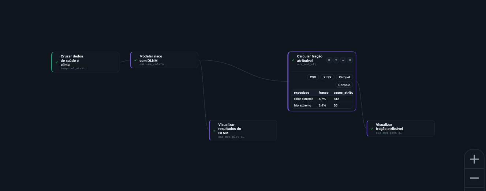

No Capítulo 3 você montou uma série integrada — saúde, clima e, quando relevante,
território, lado a lado na mesma linha do tempo. Fechamos aquele capítulo com um aviso
importante: essa série é uma comparação, não uma prova. Uma série integrada ajuda a
levantar hipótese e comunicar um problema, mas não mostra, isoladamente, se o padrão observado
é compatível com um efeito do clima sobre a saúde ou com variação esperada nos dados.
Responder a essa pergunta — **há evidência de efeito ou apenas variação estatística?** — é o
trabalho da Etapa **Análise & Modelagem**.

Este capítulo mantém a régua operacional dos Capítulos 2 e 3: público principal é
acadêmico e gestor técnico, quem vai efetivamente ajustar um modelo. Quem quer só
entender o panorama pode ler a seção de grupos de Funções e pular direto para o resumo
do fim do capítulo.

## Por que a Análise & Modelagem vem depois da Integração

Uma série integrada mostra clima e saúde na mesma linha do tempo — mas séries de saúde
têm tendência sazonal própria (mais casos respiratórios no inverno, por exemplo,
independentemente do clima daquele ano específico), têm dias da semana com padrões diferentes,
e têm ruído aleatório dia a dia. Sem um modelo estatístico que separe esses componentes,
é fácil atribuir ao clima um padrão que na verdade é sazonalidade, tendência de longo
prazo, ou coincidência de amostra pequena. A Etapa Análise & Modelagem existe para fazer
essa separação com método explícito — reportando, dependendo do método, um intervalo de
confiança (a faixa plausível de valores do efeito, não um número único), um valor-p ou
uma probabilidade posterior (o quanto o padrão observado é compatível com puro acaso).
Esses números não são um selo de aprovação: eles ajudam a distinguir um efeito provável
de um padrão que pode ser só ruído de amostra pequena — e é isso que torna a estimativa
mais bem documentada antes de qualquer decisão de política pública ser tomada com base
nela.

## As 32 Funções da Análise & Modelagem, em 6 grupos

A Biblioteca reúne 32 Funções na Etapa Análise & Modelagem — a maior das quatro Etapas —
organizadas em seis famílias. Cada uma responde a um tipo diferente de pergunta:

**(a) Núcleo temporal (defasagem e desfecho agregado)** — a família mais usada para a
pergunta "quanto do desfecho de saúde é explicado pelo clima, considerando a defasagem?".

- **Modelar risco com DLNM** (`sus_mod_dlnm`) — ajusta um Modelo de Defasagem Não Linear Distribuída (DLNM), a Função
  de referência desta família, descrita em detalhe na próxima seção.
- **Calcular fração atribuível** (`sus_mod_af`) — calcula a fração e o número atribuível a partir de um Modelo DLNM já
  ajustado.
- **Estimar excesso de óbitos** (`sus_mod_excess`) — estima excesso de mortalidade/morbidade comparando a série
  observada com uma linha de base esperada.
- **Combinar DLNM entre cidades** (`sus_mod_pool`) — combina estimativas de DLNM de várias cidades em duas etapas
  (meta-análise), indicado quando o estudo cobre mais de um município.
- **Explicar diferenças entre cidades** (`sus_mod_metaregression`) — explica por que o efeito varia entre cidades ao cruzar as
  estimativas combinadas com covariáveis no nível da cidade (renda, latitude, etc.).
- **Comparar sensibilidade entre grupos** (`sus_mod_sensitivity`) — repete a análise em vários subgrupos (por faixa etária, por
  período) para checar se o resultado se mantém estável.
- Visualizações dedicadas: **Visualizar resultados do DLNM** (`sus_mod_plot_dlnm`),
  **Visualizar fração atribuível** (`sus_mod_plot_af`), **Visualizar meta-análise de
  DLNM** (`sus_mod_plot_pool`) e **Visualizar análise de sensibilidade**
  (`sus_mod_plot_sensitivity`).

**(b) Desenhos quase-experimentais** — alternativas ao DLNM para perguntas mais
específicas: o case-crossover serve para exposição aguda com poucos anos de dados, e a
série interrompida serve para avaliar se uma intervenção pontual mudou o desfecho.

- **Analisar com case-crossover** (`sus_mod_casecrossover`) — compara cada caso com ele mesmo em dias de controle
  próximos (mesmo mês, mesmo dia da semana), indicado para exposição aguda com poucos anos
  de dados.
- **Avaliar impacto com série interrompida** (`sus_mod_its`) — série temporal interrompida, avalia se um evento ou intervenção
  específica (por exemplo, uma política de alerta de onda de calor) mudou o nível ou a
  tendência do desfecho depois de acontecer.

**(c) Espacial** — a pergunta muda de "quando" para "onde": existe aglomerado de casos
que não é explicado só pelo acaso?

- **Construir vizinhança entre municípios** (`sus_mod_spatial_weights`) — monta a matriz de vizinhança entre municípios, pré-requisito
  para todas as demais Funções deste grupo.
- **Mapear risco com Bayes espacial (CAR/BYM)** (`sus_mod_spatial_bayes`) — Modelo Bayesiano espacial (CAR/BYM) com covariáveis
  climáticas; suaviza taxas por município com a informação dos vizinhos.
- **Testar autocorrelação espacial (Moran)** (`sus_mod_spatial_moran`) — Moran global e LISA local, detecta autocorrelação espacial
  e mapeia clusters de alto-alto/baixo-baixo.
- **Modelar regressão espacial** (`sus_mod_spatial_reg`) — regressão espacial (SAR/SEM/SDM/SAC) para associações
  clima-saúde que levam em conta a dependência espacial entre municípios vizinhos.
- **Detectar clusters de doença (Kulldorff)** (`sus_mod_spatial_scan`) — estatística de varredura circular de Kulldorff, detecta
  clusters espaciais de forma mais formal que o Moran local.
- Visualizações dedicadas: **Mapear risco com Bayes espacial**
  (`sus_mod_plot_spatial_bayes`), **Visualizar clusters espaciais (Moran)**
  (`sus_mod_plot_spatial_moran`) e **Mapear clusters de Kulldorff**
  (`sus_mod_plot_spatial_scan`).

**(d) Espaço-tempo bayesiano** — quando "quando" e "onde" precisam ser respondidos
juntos.

- **Modelar risco espaço-temporal (Bayes)** (`sus_mod_spacetime_bayes`) — Modelo Bayesiano hierárquico espaço-temporal com INLA,
  a versão mais completa (e mais exigente computacionalmente) do catálogo.
- **Calcular probabilidade de excedência** (`sus_mod_spacetime_exceedance`) — probabilidades posteriores de exceder um limiar,
  a partir de um Modelo espaço-tempo já ajustado — aplicado à vigilância ("qual a chance
  deste município passar do limite este mês?").
- **Prever risco futuro no espaço-tempo** (`sus_mod_spacetime_predict`) — gera predições a partir de um Modelo espaço-tempo
  ajustado, para municípios ou períodos fora da amostra original.
- **Mapear risco espaço-temporal** (`sus_mod_plot_spacetime`) — visualizações dedicadas para os Resultados espaço-tempo.

**(e) Aprendizado de máquina** — quando o objetivo é prever, não explicar.

- **Prever desfechos com machine learning** (`sus_mod_ml`) — treina um Modelo XGBoost para prever o desfecho de saúde a partir de
  variáveis climáticas, ambientais e socioeconômicas.
- **Visualizar modelo de machine learning** (`sus_mod_plot_ml`) — gráficos de desempenho (erro de predição) e de importância de
  variáveis do Modelo treinado.

**(f) Síntese e triagem para gestão** — Funções voltadas à decisão de prioridade pelo
gestor público, não à publicação acadêmica.

- **Ranquear carga de doença por cidade** (`sus_mod_burden`) — tabela ranqueada de carga de doença entre cidades ou estratos,
  ajuda a priorizar onde agir primeiro.
- **Montar análise SWOT climática** (`sus_mod_swot`) — Análise SWOT clima-saúde (forças, fraquezas, oportunidades, ameaças)
  estruturada a partir dos dados do Pipeline.
- **Calcular índice de vulnerabilidade (IPCC)** (`sus_mod_vulnerability_index`) — índice composto de vulnerabilidade de 3 pilares do
  IPCC (exposição, sensibilidade, capacidade adaptativa), sintetiza clima e território
  num único número por município.
- Visualizações dedicadas: **Visualizar carga de doença por cidade**
  (`sus_mod_plot_burden`), **Visualizar análise SWOT** (`sus_mod_plot_swot`) e
  **Visualizar índice de vulnerabilidade** (`sus_mod_plot_vulnerability`).

::: {.callout-tip}
## Por onde começar: qual grupo escolher
Se a pergunta é "o clima está causando X, e quanto?" num recorte de tempo (uma cidade,
uma série longa), comece pelo núcleo temporal (DLNM). Se você tem poucos anos de dados
ou quer avaliar uma intervenção pontual, os desenhos quase-experimentais servem melhor.
Se a pergunta é "onde estão os aglomerados?", vá para o grupo espacial; se precisa das
duas perguntas ao mesmo tempo (quando **e** onde), o espaço-tempo bayesiano é o caminho,
mas exige mais dados e mais tempo de Motor. Aprendizado de máquina entra quando o objetivo é
prever um valor futuro, não explicar uma relação causal. Síntese/triagem é o ponto de
partida quando o gestor público só precisa de um ranking ou um índice para decidir
prioridade, sem entrar no detalhe estatístico dos outros grupos.
:::

## Função-chave da Etapa: Modelar risco com DLNM
**Modelar risco com DLNM** (`sus_mod_dlnm`) ajusta um **Modelo de Defasagem Não Linear Distribuída** (DLNM) — o método
mais usado na literatura de clima e saúde para responder à pergunta apresentada no
Capítulo 0: o efeito de uma variável climática sobre um
desfecho de saúde não é instantâneo nem constante, ele se distribui ao longo de vários
dias depois da exposição, e essa distribuição pode ter formato não linear (por exemplo,
tanto calor extremo quanto frio extremo aumentam o risco, com o meio-termo sendo mais
seguro).

O Modelo recebe a série integrada (Capítulo 3) e exige duas decisões centrais, que
formalizam estatisticamente a "defasagem" do Capítulo 0:

- **A forma da relação exposição-resposta** — como o risco muda com o nível da variável
  climática (por exemplo, uma curva em U para temperatura, em que tanto frio quanto
  calor aumentam o risco de óbito).
- **A forma da relação de defasagem** — como o risco se distribui ao longo dos dias
  depois da exposição (o efeito do calor de hoje pode ser mais forte já amanhã e cair
  rápido; o efeito do frio costuma se estender por mais dias).

O Resultado de **Modelar risco com DLNM** (`sus_mod_dlnm`) já é interpretável sozinho (Função **Visualizar resultados do DLNM** (`sus_mod_plot_dlnm`)
produz o gráfico tridimensional exposição-defasagem-risco usado na literatura), mas o
Resultado que mais importa para gestão pública normalmente vem da Função seguinte,
**Calcular fração atribuível** (`sus_mod_af`): a partir do Modelo ajustado, ela calcula a **fração atribuível
populacional** — que proporção dos casos observados pode ser atribuída ao clima, dado o
Modelo e o cenário de exposição considerado — e o **número atribuível** — quantos casos
isso representa em números absolutos. É essa dupla (fração + número) que transforma uma
curva estatística em um argumento de política pública ("X% das internações
cardiovasculares de idosos nesta cidade são estimadas como atribuíveis a dias de calor
extremo, o equivalente a Y internações por ano"). É uma estimativa populacional, com sua
própria margem de incerteza — ela não diz que um caso individual específico foi causado
pelo calor, e sim que, em agregado, essa fração dos casos não seria esperada se o cenário
de exposição ao calor extremo não tivesse ocorrido.

## Exercício guiado: do calor extremo à fração atribuível

Vamos retomar o arco de **doença cardiovascular em idosos e ondas de calor**
(`ec-03-cardio-idosos-calor`) aberto no recorte "calor" do Capítulo 0. É um caso frequente
de uso do núcleo temporal: efeito agudo, mesmo-dia a poucos dias de defasagem, um único
Modelo DLNM já é suficiente para responder à pergunta de gestão. O Modelo de catálogo
`mod-dlnm` traz o esqueleto deste exercício e pode ser carregado no Centro de Pipelines
para conferência.

{#fig-studio-modelagem-pipeline fig-alt="Captura do canvas do climasus+ Studio mostrando um Pipeline de Análise e Modelagem com cruzamento saúde-clima, modelo DLNM, visualização do DLNM, fração atribuível e visualização da fração atribuível."}

::: {.callout-tip}
## Parâmetros que merecem atenção
Na Modelagem, os Parâmetros importantes são os que ligam a série integrada ao modelo:
`outcome_col` indica o desfecho, `climate_col` indica a exposição, `lag_max` define até
quantos dias de defasagem o modelo considera, e as escolhas de curva controlam a forma da
relação exposição-resposta. Para gestão, confira também os Parâmetros usados em
**Calcular fração atribuível**, porque eles definem qual faixa de exposição será
atribuída ao clima.
:::

### Passo a passo

1. **Ponto de partida** — a série integrada de saúde × clima montada no Capítulo 3 (óbitos
   cardiovasculares em idosos × temperatura do ar, agregados por dia).

2. **Ajustar o Modelo** — Função **Modelar risco com DLNM** (`sus_mod_dlnm`), com `outcome_col` apontando para a
   coluna de contagem de óbitos. O Resultado inclui a curva exposição-resposta e a
   estrutura de defasagem já ajustadas.

3. **Visualizar a curva** — Função **Visualizar resultados do DLNM** (`sus_mod_plot_dlnm`), gráfico tridimensional
   exposição-defasagem-risco — uma forma visual de mostrar "o risco sobe
   acima de qual temperatura, e por quantos dias esse efeito persiste".

4. **Calcular o impacto** — Função **Calcular fração atribuível** (`sus_mod_af`), a partir do Modelo ajustado, que produz
   fração e número atribuível ao calor extremo.

5. **Comunicar o Resultado** — Função **Visualizar fração atribuível** (`sus_mod_plot_af`), Resultado gráfico/tabela pronto
   para levar a um gestor público sem exigir que ele leia a curva DLNM bruta.

Se o estudo cobrir mais de uma cidade, o próximo Passo depois de **Modelar risco com DLNM** (`sus_mod_dlnm`)
em cada cidade é **Combinar DLNM entre cidades** (`sus_mod_pool`), para combinar as estimativas — e, se o efeito variar muito
entre cidades, **Explicar diferenças entre cidades** (`sus_mod_metaregression`) ajuda a entender por quê (renda, latitude,
acesso a ar-condicionado, por exemplo). O Modelo de catálogo
`ec-03-cardio-idosos-calor` retoma esse cruzamento em um estudo de caso completo, no
módulo dedicado aos estudos aplicados.

## Cuidado: um bom Modelo ainda não sai do Studio sozinho

O Resultado de **Calcular fração atribuível** (`sus_mod_af`) é uma estimativa estatística
com modelo e incerteza explícitos — mais informativa do que a série integrada do Capítulo
3. Ainda assim, não é uma resposta definitiva: a estimativa depende
das escolhas feitas no Modelo (quais covariáveis entraram, qual defasagem foi assumida,
que outros fatores não foram medidos) e continua sujeita à mesma cautela de sempre —
associação, mesmo bem modelada estatisticamente, não é prova de causa isolada; é a
melhor explicação que os dados e o Modelo sustentam até que surja evidência que a
contradiga. Além disso, o Resultado ainda vive dentro do Pipeline do Studio: para
virar um relatório técnico entregável, um artigo submetido a uma revista, ou uma rotina
executada todo mês sem que alguém precise reabrir o Studio, falta uma etapa.
Essa é a Etapa **RAP** (Reprodutibilidade, Automação, Publicação): ela transforma esse
Resultado em material reprodutível fora da interface visual.

::: {.callout-note collapse="true"}
## Verifique se ficou

**1. Por que uma série integrada (Capítulo 3) não é, isoladamente, prova de que o clima causa
o desfecho de saúde?**

Porque séries de saúde têm sazonalidade, tendência de longo prazo e ruído próprios, que
podem se parecer com um efeito climático sem ser causados por ele; um Modelo estatístico
(DLNM ou outro) é necessário para separar esses componentes com intervalo de confiança
ou probabilidade posterior.

**2. Você tem só 2 anos de dados de um único município e quer avaliar se uma política de
alerta de onda de calor reduziu internações depois de implementada. Modelar risco com
DLNM (`sus_mod_dlnm`) é a melhor escolha?**

Não. A pergunta é sobre o efeito de uma intervenção pontual num ponto específico do
tempo; esse é o uso de **Avaliar impacto com série interrompida**
(`sus_mod_its`) — ela compara o nível/tendência da série antes e depois da política.
**Analisar com case-crossover** (`sus_mod_casecrossover`) não resolve essa pergunta: por
desenho, ele remove tendências de longo prazo comparando cada caso com dias de controle
próximos — o que também elimina qualquer contraste "antes e depois" da política, que é
justamente o que se quer medir aqui. O case-crossover é adequado para outra pergunta
(associação com exposição aguda de curto prazo), não para avaliar se uma intervenção
pontual mudou o desfecho.

**3. Qual a diferença entre o grupo espacial, com funções como Mapear risco com Bayes
espacial (`sus_mod_spatial_bayes`) e Detectar clusters de doença (`sus_mod_spatial_scan`),
e o grupo espaço-tempo bayesiano, representado por Modelar risco espaço-temporal
(`sus_mod_spacetime_bayes`)?**

O grupo espacial responde "onde estão os aglomerados", com o território em um único
recorte de tempo; o espaço-tempo bayesiano responde "onde **e** quando", com as
duas dimensões no mesmo Modelo — exige mais dados e mais tempo de Motor, mas é necessário quando
o padrão espacial muda ao longo do tempo.
:::
