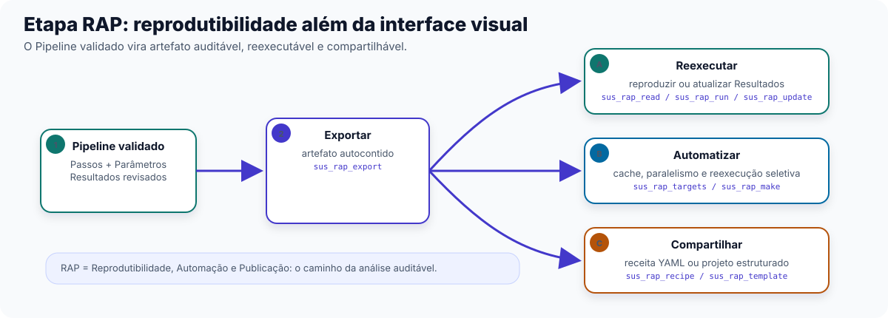
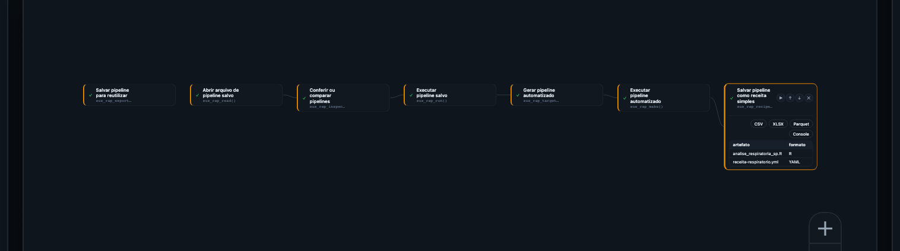

No Capítulo 4 você chegou a uma fração atribuível — uma estimativa, com modelo e
incerteza, da parcela dos óbitos ou internações estudados associada a um fator climático.
Esse Resultado ainda vive dentro do Pipeline do Studio. Para virar um relatório técnico
entregável, um artigo submetido a uma revista, ou uma rotina executada todo mês
sem que ninguém precise reabrir o Studio, falta uma última Etapa: **RAP**
(Reprodutibilidade, Automação, Publicação).

Este capítulo mantém a régua operacional dos Capítulos 2 a 4: público principal é
acadêmico e gestor técnico, quem vai efetivamente levar a análise para fora do Studio.

## Por que a RAP vem por último

Um Pipeline montado no Studio é visual e interativo: Nós numa tela, Parâmetros
preenchidos no Inspetor. Isso ajuda na exploração e no ajuste da análise, mas não resolve
três necessidades frequentes de gestores, pesquisadores e equipes de dados: (1) executar
a mesma análise de novo, mês que vem, com
dados atualizados, sem reabrir o Studio e reconstruir tudo manualmente; (2) entregar a
análise para alguém revisar ou auditar sem exigir que essa pessoa tenha o Studio aberto
na tela; (3) publicar a análise (artigo, relatório técnico) de um jeito que outro
pesquisador consiga reproduzir o resultado. A Etapa RAP existe para resolver
essas três necessidades ao converter o Pipeline validado em um **artefato** que existe
fora da interface visual do Studio.

## As 12 Funções da RAP, em 3 grupos

A Biblioteca reúne 12 Funções na Etapa RAP — a menor das quatro Etapas, mas a única cujo
Resultado não é uma tabela, gráfico ou mapa: é o próprio Pipeline, em forma reprodutível.

**(a) Exportar, ler, inspecionar e executar** — o ciclo básico de tirar um Pipeline do
Studio e voltar a rodá-lo.

- **Salvar pipeline para reutilizar** (`sus_rap_export`) — exporta o Pipeline montado no Studio como um artefato reprodutível,
  um arquivo de código autocontido pronto para reexecução fora do Studio.
- **Exportar pipeline selecionado** (`sus_rap_addin_export`) — a mesma exportação, disponível como atalho integrado a um
  ambiente de desenvolvimento avançado, para quem já trabalha direto com código fora do Studio.
- **Abrir arquivo de pipeline salvo** (`sus_rap_read`) — lê um artefato RAP já exportado e recarrega o objeto para
  inspeção ou reexecução.
- **Conferir ou comparar pipelines** (`sus_rap_inspect`) — inspeciona os Passos de um artefato RAP, ou compara dois artefatos
  (diff) para ver o que mudou entre duas versões da análise.
- **Atualizar parâmetros do pipeline salvo** (`sus_rap_update`) — atualiza Parâmetros dentro de um artefato RAP já exportado, sem
  precisar refazer a exportação do zero.
- **Executar pipeline salvo** (`sus_rap_run`) — reexecuta um artefato RAP exportado e reproduz (ou atualiza, se
  os dados de entrada mudaram) o Resultado original.
- **Abrir painel visual do pipeline** (`sus_rap_gui`) — abre uma interface gráfica independente do Studio para editar e rodar
  artefatos RAP, indicado para quem recebeu o artefato de outra pessoa e não montou o
  Pipeline original.

**(b) Automação com targets** — para análises que envolvem muitas etapas, muitos
municípios ou muitos anos, e que precisam de cache e reexecução seletiva.

- **Gerar pipeline automatizado** (`sus_rap_targets`) — gera um pipeline `_targets` a partir de um artefato RAP.
- **Executar pipeline automatizado** (`sus_rap_make`) — executa o pipeline `targets` gerado, com cache automático (só
  reexecuta o que mudou desde a última vez) e paralelismo.

**(c) Compartilhamento e scaffolding** — para levar a análise a outra pessoa ou começar
um novo projeto do zero, já estruturado.

- **Salvar pipeline como receita simples** (`sus_rap_recipe`) — exporta um artefato RAP como uma receita YAML compacta, mais fácil
  de revisar e versionar do que o arquivo de código completo.
- **Importar pipeline salvo** (`sus_rap_from_recipe`) — importa (e opcionalmente já executa) uma receita YAML recebida
  de outra pessoa.
- **Criar novo projeto de análise** (`sus_rap_template`) — cria a estrutura completa de um novo projeto de Pipeline
  Analítico Reprodutível, com pastas e arquivos convencionados, para quem começa uma
  análise do zero fora do Studio.

::: {.callout-tip}
## Qual caminho seguir depois de exportar
Se o objetivo é só rodar a mesma análise de novo com dados atualizados, use **Abrir
arquivo de pipeline salvo** (`sus_rap_read`) e **Executar pipeline salvo**
(`sus_rap_run`); se algum Parâmetro mudou, aplique antes **Atualizar parâmetros do
pipeline salvo** (`sus_rap_update`). Se a análise tem muitas etapas custosas (vários
municípios, vários anos, vários Modelos), vale investir em **Gerar pipeline
automatizado** (`sus_rap_targets`) — o cache evita reprocessar o que já rodou antes. Se o
objetivo é compartilhar com um colega ou revisor, **Salvar pipeline como receita
simples** (`sus_rap_recipe`) é mais fácil de revisar que o arquivo de código bruto; se o objetivo é começar um
projeto novo já estruturado, **Criar novo projeto de análise**
(`sus_rap_template`) é o ponto de partida.
:::

## Exercício guiado: do Pipeline validado ao artefato compartilhável

Vamos continuar o arco de **mortalidade respiratória pediátrica** aberto no recorte "ar"
do Capítulo 0 (`ec-01-respiratorio-pediatrico`), assumindo que os Capítulos 2 a 4 já
foram percorridos e o Pipeline chegou a uma fração atribuível validada. Os Modelos de
catálogo `rap-exportar-executar`, `rap-targets` e `rap-compartilhar-scaffold` trazem,
juntos, o esqueleto completo deste exercício.

{#fig-studio-rap-pipeline fig-alt="Captura do canvas do climasus+ Studio mostrando um Pipeline RAP com exportação, leitura, inspeção, execução, automação com targets e receita YAML."}

::: {.callout-tip}
## Parâmetros que merecem atenção
Na Etapa RAP, os Parâmetros são menos epidemiológicos e mais operacionais. `file_path`
define onde o artefato será salvo ou lido; Parâmetros de atualização mudam valores dentro
de um Pipeline exportado; e as opções ligadas a `targets` controlam automação, cache e
reexecução. Aqui, o cuidado principal é garantir que o arquivo gerado represente o
Pipeline validado.
:::

### Passo a passo

1. **Exportar** — Função **Salvar pipeline para reutilizar** (`sus_rap_export`), que transforma o Pipeline validado (montado
   nos capítulos anteriores) num artefato reprodutível autocontido — por exemplo, um
   arquivo chamado `analise_respiratoria_sp`.

2. **Reabrir e inspecionar** — Função **Abrir arquivo de pipeline salvo** (`sus_rap_read`) com `path` apontando para o arquivo
   exportado, seguida de **Conferir ou comparar pipelines** (`sus_rap_inspect`) para conferir que todos os Passos foram
   preservados corretamente.

3. **Executar de novo** — Função **Executar pipeline salvo** (`sus_rap_run`), que reproduz o Resultado original a
   partir do artefato — etapa usada para confirmar que o artefato exportado
   reproduz o que o Studio mostrava.

4. **Automatizar, se a análise crescer** — quando o mesmo artefato precisar rodar para
   várias UFs ou vários anos, **Gerar pipeline automatizado** (`sus_rap_targets`) gera um `_targets` a partir dele, e
   **Executar pipeline automatizado** (`sus_rap_make`) executa com cache: só recalcula o que mudou.

5. **Compartilhar** — Função **Salvar pipeline como receita simples** (`sus_rap_recipe`), que gera uma receita YAML compacta do
   mesmo Pipeline, pronta para ser lida por um colega com **Importar pipeline salvo** (`sus_rap_from_recipe`) — ou,
   para começar um projeto novo do zero com a mesma estrutura, **Criar novo projeto de análise** (`sus_rap_template`).

Ao final deste exercício, o recorte de respiratório pediátrico sai do Studio como
artefato reprodutível, pronto para relatório técnico, publicação ou reexecução
automatizada.

## Fechando o piloto

Com este capítulo, as quatro Etapas do Pipeline — Preparação, Integração, Análise &
Modelagem e RAP — foram todas percorridas ao menos uma vez, com um exercício guiado
completo em cada uma. O curso completo cobre as 87 Funções do catálogo com mais
profundidade e retoma os quatro arcos abertos no Capítulo 0 (respiratório, dengue,
cardiovascular, frio) como estudos de caso completos — ver "Próximos
capítulos" no início do guia.

::: {.callout-note collapse="true"}
## Verifique se ficou

**1. Por que um Pipeline montado no Studio, sozinho, não é suficiente para publicar um
artigo ou entregar um relatório técnico auditável?**

Porque ele existe como Nós numa tela interativa; publicação e auditoria exigem um
artefato que exista fora da interface visual e que outra pessoa consiga abrir, ler ou
reexecutar sem precisar do Studio aberto — é isso que **Salvar pipeline para reutilizar** (`sus_rap_export`) produz.

**2. Sua análise agora cobre 15 anos de dados e 4 municípios, e está ficando lenta para
reexecutar do zero toda vez que você ajusta um detalhe. Qual grupo de Funções da RAP
resolve isso?**

O grupo de automação com `targets`: **Gerar pipeline automatizado** (`sus_rap_targets`) e
**Executar pipeline automatizado** (`sus_rap_make`). Ele gera um pipeline com cache, que
reexecuta só as partes que mudaram desde a última rodada, em vez de recalcular tudo.

**3. Qual a diferença entre exportar um artefato RAP como arquivo de código completo,
usando Salvar pipeline para reutilizar (`sus_rap_export`), e exportar como receita YAML,
usando Salvar pipeline como receita simples (`sus_rap_recipe`)?**

Os dois representam o mesmo Pipeline reprodutível; o arquivo de código é o artefato
completo e autoexecutável, enquanto a receita YAML é uma versão mais compacta, adequada
para compartilhar ou versionar — pode ser reimportada com **Importar pipeline salvo** (`sus_rap_from_recipe`).
:::
