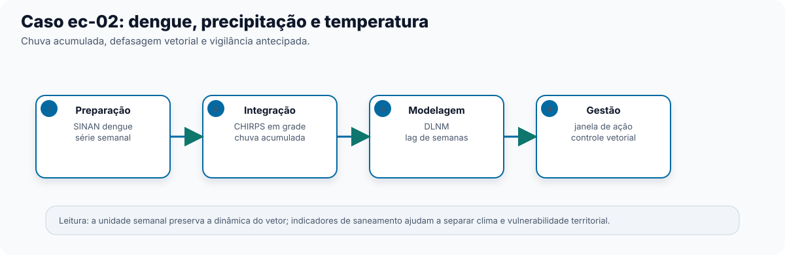

No recorte "chuva" do Capítulo 0, retomado na Etapa Integração (Capítulo 3),
apresentamos o arco de dengue e clima: chuva acumulada, não chuva pontual, é o que
importa para o mosquito completar seu ciclo. Este capítulo fecha esse arco, do dado bruto
do SINAN ao Modelo DLNM ajustado. Público principal: acadêmico e gestor técnico
responsável por vigilância de arboviroses.

## O pipeline completo, etapa por etapa

Recorte: casos de dengue (SINAN) no Nordeste, 2015-2019, contra precipitação por
satélite (CHIRPS, em grade). O Modelo de catálogo `ec-02-dengue-clima` traz este Pipeline
pronto para carregar no Centro de Pipelines.

**Preparação**

1. **Importar dados do DATASUS** (`sus_data_import`) — importa casos do sistema `SINAN-DENGUE`, região Nordeste, anos de
   2015 a 2019.
2. **Corrigir acentuação e caracteres** (`sus_data_clean_encoding`) — corrige encoding.
3. **Padronizar nomes e valores** (`sus_data_standardize`) — padroniza nomes de coluna e tipos.
4. **Filtrar por CID-10 ou grupo de doença** (`sus_data_filter_cid`) — filtra pelo grupo de doença dengue.
5. **Criar variáveis derivadas** (`sus_data_create_variables`) — cria variáveis de calendário (semana epidemiológica,
   entre outras).
6. **Agregar dados em série temporal** (`sus_data_aggregate`) — agrega a série por semana — a unidade de tempo certa para
   dengue, mais fina que os meses usados no recorte respiratório do Capítulo 6.

**Integração**

7. **Importar chuva por satélite (CHIRPS)** (`sus_grid_chirps`) — traz precipitação em grade por satélite, resolução mensal,
   mesmos anos.
8. **Juntar dados ambientais por município** (`sus_grid_join`) — une o dado de chuva em grade à série de saúde já agregada,
   sem depender de estação meteorológica próxima (o Nordeste tem cobertura de estação
   irregular em muitos municípios, e a região de estudo é grande — o mesmo
   cenário em que o Capítulo 3 recomenda usar clima em grade).

**Análise & Modelagem**

9. **Modelar risco com DLNM** (`sus_mod_dlnm`) — ajusta o Modelo DLNM, com `outcome_col` apontando para a contagem
   de casos de dengue.
10. **Visualizar resultados do DLNM** (`sus_mod_plot_dlnm`) — Resultado gráfico da curva exposição-defasagem-risco.

## Interpretando o resultado

A curva de **Visualizar resultados do DLNM** (`sus_mod_plot_dlnm`) para este recorte tipicamente mostra o risco de dengue
subindo com o acúmulo de chuva ao longo de várias semanas — não no mesmo dia, nem na
mesma semana, da chuva. É essa defasagem de semanas (o tempo do mosquito criar água
parada, desenvolver e picar) que o DLNM captura e que uma correlação simples entre
"chuva de hoje" e "casos de hoje" perderia completamente — reforçando o ponto do
Capítulo 0: o efeito do clima na saúde quase nunca aparece no mesmo dia do evento
climático.

Diferente do recorte respiratório pediátrico (Capítulo 6), este Pipeline não seguiu até
**Calcular fração atribuível** (`sus_mod_af`): para dengue, a fração atribuível de casos ao clima é só parte da decisão de
gestão — o restante depende de indicadores de território (saneamento, infraestrutura de
água parada), que o Capítulo 3 já indicou como necessários para não confundir efeito
climático com efeito de vulnerabilidade social. Um Pipeline mais completo somaria aqui
**Calcular indicadores socioeconômicos e de saúde** (`sus_socio_compute_indicators`) antes da Etapa Análise & Modelagem.

## O que isso significa para ação

Saber quantas semanas de defasagem existem entre chuva acumulada e pico de casos permite
à gestão de vetores agir de forma antecipada — por exemplo, intensificando o controle de
criadouros assim que um período de chuva acima do padrão é observado, em vez de esperar
os casos já aparecerem nos registros de saúde.

Para levar este Pipeline além do Studio — relatório técnico, publicação, ou execução
automatizada a cada nova semana epidemiológica — ver Capítulo 5 (Etapa RAP).

::: {.callout-note collapse="true"}
## Verifique se ficou

**1. Por que este Pipeline agrega a série de saúde por semana (`time_unit = "week"`),
enquanto o recorte respiratório pediátrico do Capítulo 6 agregava por mês?**

Dengue tem uma dinâmica mais rápida (semanas, não meses) entre chuva acumulada e pico de
casos; agregar por semana preserva a resolução temporal necessária para o DLNM capturar
essa defasagem mais curta.

**2. Por que este Pipeline usa Importar chuva por satélite (CHIRPS) (`sus_grid_chirps`),
um dado em grade, em vez de Importar dados das estações do INMET (`sus_climate_inmet`)?**

Porque a área de estudo (região Nordeste inteira) é grande e tem muitos municípios sem
estação meteorológica bem localizada — cenário em que o Capítulo 3
recomenda clima em grade/satélite em vez de estação.

**3. O que estaria faltando neste Pipeline para responder com mais segurança "quanto do
risco de dengue é atribuível ao clima, e não a saneamento precário"?**

Um indicador de território/censo, calculado por **Calcular indicadores socioeconômicos e de saúde** (`sus_socio_compute_indicators`)
(por exemplo, de saneamento ou infraestrutura), incluído antes da Etapa Análise &
Modelagem — sem ele, o Pipeline corre o risco de atribuir ao clima um efeito que também
tem componente de vulnerabilidade social.
:::
