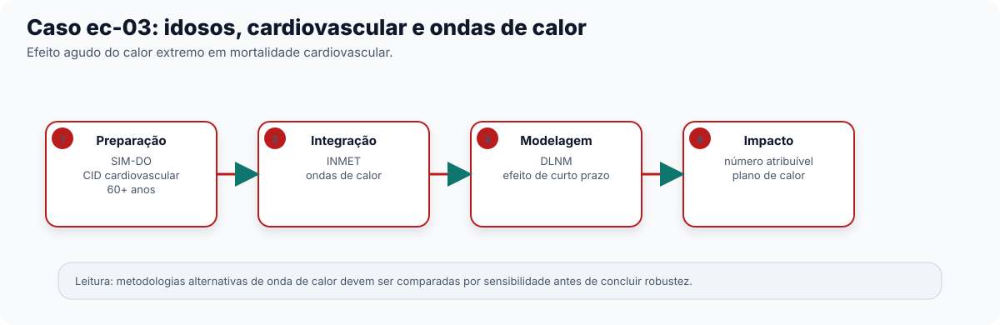

No recorte "calor" do Capítulo 0, usado como exemplo principal da Etapa Análise &
Modelagem (Capítulo 4), apresentamos o arco de calor extremo e doença cardiovascular em
idosos — um caso de efeito agudo, com defasagem curta. Este capítulo acompanha o recorte
do dado bruto do SIM-DO à carga atribuível ao calor. Público
principal: acadêmico e gestor técnico responsável por planos de contingência para ondas
de calor.

## O pipeline completo, etapa por etapa

Recorte: óbitos cardiovasculares (CID-10, capítulo I) em idosos (60 anos ou mais) em São
Paulo, 2010-2019, contra ondas de calor detectadas a partir da temperatura das estações
INMET. O Modelo de catálogo `ec-03-cardio-idosos-calor` traz este Pipeline pronto para
carregar no Centro de Pipelines.

**Preparação**

1. **Importar dados do DATASUS** (`sus_data_import`) — importa óbitos do sistema `SIM-DO`, UF `SP`, anos de 2010 a 2019
   — uma janela mais longa que o recorte respiratório pediátrico do Capítulo 6, porque
   ondas de calor extremas não acontecem todo ano.
2. **Corrigir acentuação e caracteres** (`sus_data_clean_encoding`) — corrige encoding.
3. **Padronizar nomes e valores** (`sus_data_standardize`) — padroniza nomes de coluna e tipos.
4. **Filtrar por CID-10 ou grupo de doença** (`sus_data_filter_cid`) — filtra pelo capítulo I inteiro (`match_type = "chapter"`),
   cobrindo todo o espectro de doenças cardiovasculares.
5. **Criar variáveis derivadas** (`sus_data_create_variables`) — cria a faixa etária `c(0, 60, Inf)`.
6. **Filtrar por características demográficas** (`sus_data_filter_demographics`) — recorta para `age_range = c(60, Inf)`, isolando a
   população idosa.
7. **Agregar dados em série temporal** (`sus_data_aggregate`) — agrega a série por dia — a unidade de tempo certa aqui, porque
   o efeito do calor sobre óbito cardiovascular agudo é quase imediato (Capítulo 4).

**Integração**

8. **Importar dados das estações do INMET** (`sus_climate_inmet`) — traz temperatura das estações INMET de SP, mesmos anos.
9. **Detectar ondas de calor** (`sus_climate_compute_heatwaves`) — detecta ondas de calor com a metodologia da OMS
   (`method = "WHO"`) e percentil 90 como limiar.

**Análise & Modelagem**

10. **Modelar risco com DLNM** (`sus_mod_dlnm`) — ajusta o Modelo DLNM sobre a série diária, com `outcome_col`
    apontando para a contagem de óbitos.
11. **Calcular fração atribuível** (`sus_mod_af`) — calcula a fração e o número atribuível ao calor extremo.
12. **Visualizar fração atribuível** (`sus_mod_plot_af`) — Resultado gráfico/tabela pronto para comunicação.

## Interpretando o resultado

Diferente do arco de dengue (Capítulo 7), aqui o DLNM tende a mostrar a maior parte do
efeito concentrada nos primeiros dias após a exposição ao calor — compatível com a
fisiologia do estresse térmico agudo sobre o sistema cardiovascular. A fração atribuível
resultante de **Calcular fração atribuível** (`sus_mod_af`) já responde à pergunta de gestão: que proporção
dos óbitos cardiovasculares em idosos, no período estudado, é atribuível especificamente
a dias de calor acima do limiar de onda de calor detectado.

**Detectar ondas de calor** (`sus_climate_compute_heatwaves`) oferece sete metodologias de detecção de
onda de calor (OMS, OMM, INMET, entre outras) — o Capítulo 3 não detalhou essa escolha
metodológica; para um estudo publicável, recomenda-se repetir a análise com mais de uma
metodologia, com **Comparar sensibilidade entre grupos** (`sus_mod_sensitivity`), e reportar se a conclusão se mantém estável.

## O que isso significa para ação

Uma fração atribuível consistente, com intervalo de incerteza e análise de sensibilidade,
ajuda a dimensionar um plano de contingência de calor: quantos
dias de alerta por ano o município deveria esperar, e qual o impacto esperado em saúde
se nada for feito — informação que pode justificar, por exemplo, pontos de
resfriamento público ou reforço de atenção primária para idosos em dias de alerta.

Para levar este Pipeline além do Studio — relatório técnico, publicação, ou execução
automatizada a cada nova temporada de calor — ver Capítulo 5 (Etapa RAP).

::: {.callout-note collapse="true"}
## Verifique se ficou

**1. Por que este Pipeline agrega a série de saúde por dia, enquanto o recorte de
dengue do Capítulo 7 agregava por semana?**

Porque o efeito do calor extremo sobre óbito cardiovascular agudo é quase imediato
(Capítulo 4) — agregar por dia preserva a resolução temporal necessária para capturar
esse efeito de curtíssimo prazo, diferente da dinâmica mais lenta da dengue.

**2. Qual a função de Detectar ondas de calor (`sus_climate_compute_heatwaves`) neste
Pipeline, e por que ela vem antes do Modelo DLNM?**

Ela detecta, a partir da série de temperatura, quais dias configuram onda de calor
segundo uma metodologia padrão (aqui, OMS/percentil 90) — o DLNM ajustado em seguida
pode então usar essa informação para relacionar especificamente os dias de onda de
calor (não só temperatura bruta) ao desfecho cardiovascular.

**3. O texto sugere repetir a análise com mais de uma metodologia de detecção de onda de
calor usando Comparar sensibilidade entre grupos (`sus_mod_sensitivity`). Por que isso é
recomendável?**

Porque **Detectar ondas de calor** (`sus_climate_compute_heatwaves`) oferece sete metodologias diferentes de detecção,
e cada uma pode gerar limiares distintos; repetir a análise com mais de uma e comparar
os resultados com **Comparar sensibilidade entre grupos** (`sus_mod_sensitivity`) é a forma
indicada no Capítulo 4 para verificar se a conclusão se mantém quando a escolha
metodológica muda.
:::
