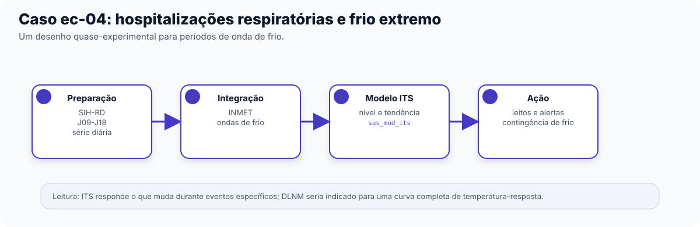

No recorte "frio" do Capítulo 0, apresentamos brevemente o outro lado do espectro de
temperatura: assim como o calor extremo, o frio extremo também tem efeito sobre a saúde
respiratória, com relevância maior para regiões de clima mais frio ou de altitude. Este
capítulo acompanha esse recorte em uma sequência completa, e é o único dos quatro estudos de caso que usa um
desenho quase-experimental (Capítulo 4) em vez do núcleo temporal DLNM. Público
principal: acadêmico e gestor técnico responsável por planos de contingência para
frio extremo.

## O pipeline completo, etapa por etapa

Recorte: internações respiratórias (SIH, CID-10 `J09`-`J18`, pneumonias e influenza) na
região Sul, 2010-2019, contra ondas de frio detectadas a partir da temperatura das
estações INMET. O Modelo de catálogo `ec-04-hospitalizacoes-frio` traz este Pipeline
pronto para carregar no Centro de Pipelines.

**Preparação**

1. **Importar dados do DATASUS** (`sus_data_import`) — importa internações do sistema `SIH-RD`, região Sul, anos de
   2010 a 2019.
2. **Corrigir acentuação e caracteres** (`sus_data_clean_encoding`) — corrige encoding.
3. **Padronizar nomes e valores** (`sus_data_standardize`) — padroniza nomes de coluna e tipos.
4. **Filtrar por CID-10 ou grupo de doença** (`sus_data_filter_cid`) — filtra pela faixa `J09-J18` (`match_type = "range"`),
   pneumonias e influenza — um recorte mais específico que o capítulo I inteiro usado no
   Capítulo 8.
5. **Criar variáveis derivadas** (`sus_data_create_variables`) — cria variáveis de calendário.
6. **Agregar dados em série temporal** (`sus_data_aggregate`) — agrega a série por dia.

**Integração**

7. **Importar dados das estações do INMET** (`sus_climate_inmet`) — traz temperatura das estações INMET da região Sul, mesmos anos.
8. **Detectar ondas de frio** (`sus_climate_compute_coldwaves`) — detecta ondas de frio com a metodologia da OMS
   (`method = "WHO"`) e percentil 10 como limiar (o espelho do percentil 90 usado para
   calor no Capítulo 8).

**Análise & Modelagem**

9. **Avaliar impacto com série interrompida** (`sus_mod_its`) — ajusta uma série temporal interrompida sobre a série diária de
   internações, avaliando se os períodos de onda de frio mudam o nível ou a tendência
   das internações respiratórias.

## Interpretando o resultado

Este é o único dos quatro estudos de caso que não usa **Modelar risco com DLNM** (`sus_mod_dlnm`). A escolha de
**Avaliar impacto com série interrompida** (`sus_mod_its`) — em vez do núcleo temporal completo — segue o critério
apresentado no Capítulo 4: séries mais curtas ou perguntas sobre um evento específico
(aqui, "o que muda nas internações quando entra um período de onda de frio?") tendem a
ser respondidas por um desenho quase-experimental, sem exigir o ajuste mais pesado
de um Modelo DLNM completo. O Resultado de **Avaliar impacto com série interrompida** (`sus_mod_its`) estima se houve
mudança de nível (um salto nas internações no início da onda de frio) e/ou de tendência
(uma inclinação diferente enquanto a onda de frio persiste).

Há uma diferença importante em relação ao Capítulo 8: calor extremo usou
DLNM porque o interesse era a curva completa de exposição-resposta ao longo de toda a
série; aqui, o interesse é mais pontual (o efeito de períodos específicos de onda de
frio), o que favorece o ITS. Nada impede repetir este mesmo recorte com **Modelar risco com DLNM** (`sus_mod_dlnm`) se
o objetivo for uma curva de exposição-resposta completa para temperaturas baixas — os
dois desenhos respondem perguntas diferentes, não são mutuamente exclusivos.

## O que isso significa para ação

Um Resultado de ITS mostrando aumento claro de internações respiratórias durante ondas de
frio sustenta um plano de contingência de frio para a região Sul — por exemplo,
reforço de leitos respiratórios pediátricos e geriátricos e campanhas de aquecimento
domiciliar seguro, dimensionados pela frequência histórica de ondas de frio detectada
por **Detectar ondas de frio** (`sus_climate_compute_coldwaves`).

Com este capítulo, os quatro arcos abertos no Capítulo 0 — ar, chuva, calor e frio —
foram percorridos em sequência completa. Para levar qualquer um deles além do Studio —
relatório técnico, publicação, ou execução automatizada — ver Capítulo 5 (Etapa RAP).

::: {.callout-note collapse="true"}
## Verifique se ficou

**1. Por que este Pipeline usa Avaliar impacto com série interrompida (`sus_mod_its`) em
vez de Modelar risco com DLNM (`sus_mod_dlnm`), diferente dos Capítulos 6 a 8?**

Porque a pergunta de interesse aqui é mais pontual — o efeito de períodos específicos de
onda de frio sobre o nível/tendência das internações — um desenho quase-experimental
como o ITS responde bem a esse tipo de pergunta sem exigir o ajuste completo de uma
curva de exposição-resposta como o DLNM.

**2. Detectar ondas de frio (`sus_climate_compute_coldwaves`) usa percentil 10 como
limiar, o espelho do percentil 90 usado para calor no Capítulo 8. O que esse limiar
representa?**

Um limiar baseado na distribuição histórica local de temperatura (os 10% dias mais
frios, ou os 10% dias mais quentes) — não um valor absoluto fixo — o que permite que a
mesma metodologia se adapte a climas regionais diferentes (Capítulo 3: `climate_region`).

**3. O texto diz que nada impede repetir este recorte com Modelar risco com DLNM
(`sus_mod_dlnm`). O que se ganharia com isso, que o ITS não oferece?**

Uma curva de exposição-resposta completa relacionando qualquer nível de temperatura
(não só os períodos classificados como onda de frio) ao risco de internação, incluindo a
estrutura de defasagem ao longo dos dias — informação mais detalhada do que a mudança de
nível/tendência que o ITS reporta.
:::
